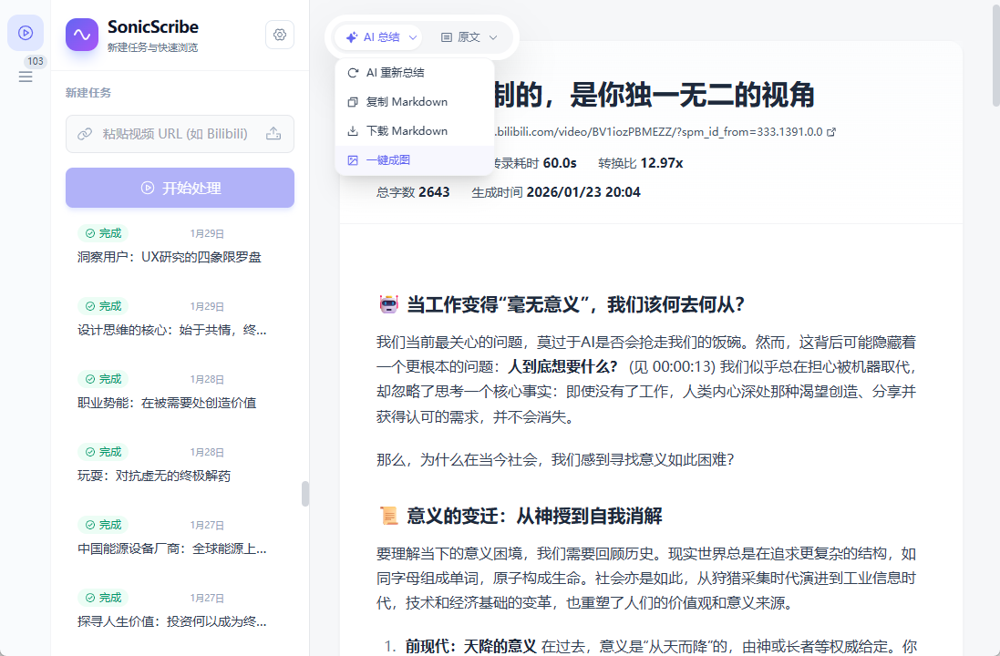
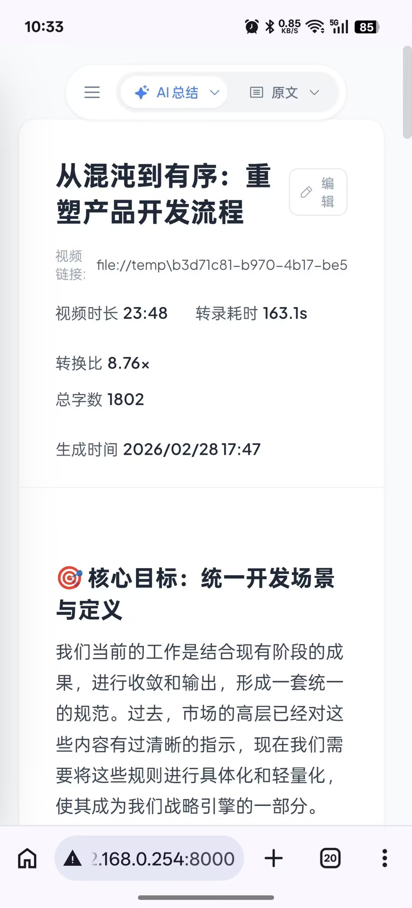
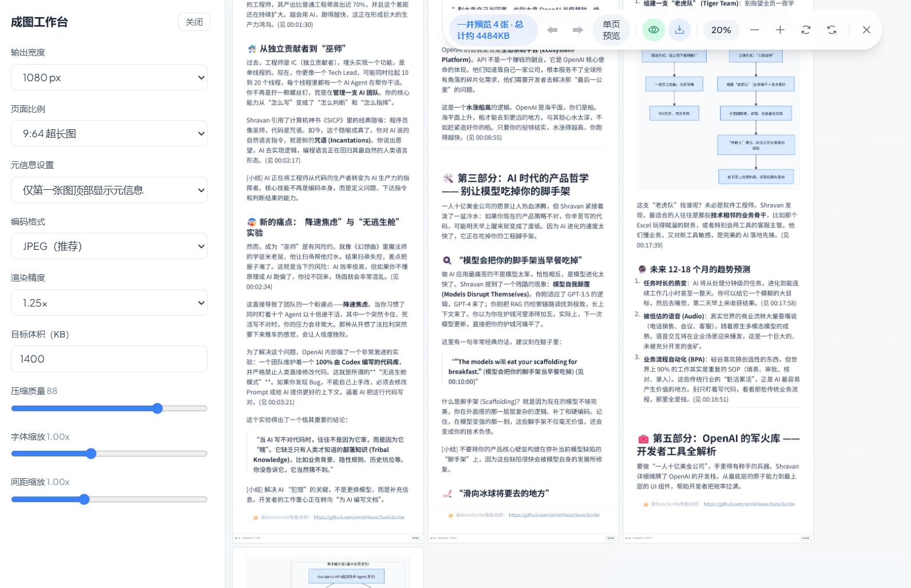
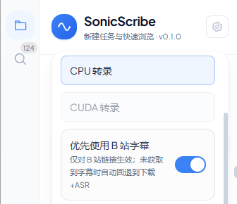

> [!CAUTION]
> **⚠ 项目已迁移**
> 
> 感谢您的关注！**本项目已迁移至新仓库**：**👉 [ShengWen - 声文智汇](https://github.com/smileFAace/ShengWen)** 
>
> 新仓库包含完整的源码、最新功能和持续更新。请移步新仓库获取最新版本。
> 
> ---
> **注：当前仓库仅作为历史存档和展示，不再更新**


# 🎙️ 声文智汇 - SonicScribe

<table align="center">
  <tr>
    <td align="center">
      
    </td>
    <td align="center">
      
    </td>
  </tr>
</table>

<p align="center">
  <strong>界面展示（PC宽屏 + 手机窄屏）</strong>
</p>

<p align="center">
  <a href="#快速部署"></a>
  <a href="LICENSE"></a>
  <a href="https://www.python.org/downloads/"></a>
  <a href="https://vuejs.org/"></a>
  <a href="https://fastapi.tiangolo.com/"></a>
</p>

**声闻智汇 - SonicScribe** 是一个一站式的、支持多输入源的、可管理多总结任务的视频转录和总结系统。支持 Bilibili 和本地音视频文件，简单操作下即可将原媒体文件转换为具有原文文案风格的、带原文时间戳的转录文本和智能内容分析。

---

**如果你需要**：

- 📝 保留原文风味细节的总结
- 🌟 AI 驱动的内容洞察
- 🌍 将一整个英文教学视频总结成中文文章
- 📚 备考视频又多又长，想快速了解知识点
- ……

这**就是**你要找的工具。


---


## 核心特性

#### **1. 智能总结引擎 🤖**
内置智能总结工作流，在信息密度、可读性和结构化表达之间做平衡，兼顾日常可用与长内容深度处理。
- 标准模式（当前已集成）：基于精心调试的提示词与总结流程，适合绝大多数视频场景。
- **Agent 增强模式**（已跑通，调试中）：面向更长内容，通过智能上下文提升细节保真和结构完整性，**解决处理长文本时由于模型上下文有限、注意力涣散而导致原文细节丢失的问题**。
  - **⬇️点击查看对比**（均由 Gemini 2.5 Pro + tiny 转录模型生成）
#### [🙂标准模式总结结果](prj-docs/长视频总结-非agent.md) vs **[😄Agent 增强模式总结结果](prj-docs/长视频总结-带agent.md)**
 （一键总结至[《如何像高级工程师一样设计API？REST、GraphQL、认证与安全核心要点》(时长01:23:21)](https://www.bilibili.com/video/BV16wZKBbEbd)）
  - 后者通常在超长内容上细节更丰富，更像是一篇详实的完整文章；但对大多数日常视频，标准模式已足够好用。

>**注：**
>*Agent 增强模式尚在调试改进中，请关注项目后续更新动态。*
对于标准模式，根据模型上下文能力不同，建议一次总结的视频长度不超过 40min - 1h
#### **2. 丰富输出 📊**
时间戳、Mermaid 图表、Markdown 一键成图导出

<p align="center">
  
  <br>
</p>

- **成图工作台**：支持先预览再导出，避免反复试错
  - 可调输出宽度、页面比例（如 9:64 超长图）
  - 可配置元信息显示策略（如仅首图显示）
  - 可选编码格式（JPEG 推荐）、渲染精度、目标体积（KB）
  - 支持压缩质量、字体缩放、间距缩放微调，兼顾清晰度与体积
  - 右侧实时查看最终排版效果（正文 + Mermaid 图表），更适合分享与归档

#### **3. 多任务管理 🧾**
进度条实时显示任务状态，任务元数据、视频链接可追溯，支持任务处理流水线
#### **4. 音视频支持 🎬**
Bilibili直链转换；本地音频/视频文件上传

当前版本对本地文件采用**扩展名白名单校验**，明确支持如下格式：

- 视频：`.mp4`、`.avi`、`.mov`、`.mkv`、`.flv`、`.wmv`、`.webm`、`.m4v`
- 音频：`.mp3`、`.wav`、`.flac`、`.aac`、`.ogg`、`.m4a`、`.wma`、`.opus`

不在上述列表中的文件会在上传时直接提示“格式不支持”并拒绝处理。
#### **5. CPU 友好 + GPU 加速 ⚡**
默认即开即用的 `CPU` 转录体验，同时提供可切换的 `CUDA` 加速路径：

- **CPU 开箱可用**：默认 `tiny + CPU`，在 i7-12700 上实测约 `10x` 识别倍率（具体耗时与音频质量、模型大小有关）
- **CUDA 智能诊断**：自动检测 `NVIDIA / PyTorch CUDA / CTranslate2` 状态；可用时启用 GPU 转录，不可用时给出原因与处理建议
- **字幕优先，回退语音识别**：可开启“优先使用字幕”，未获取到字幕时自动回退到本地语音识别

<p align="center">
  
</p>

#### **6. PC / 手机端Web阅读支持 📱**
宽屏/窄屏自适应布局，良好阅读体验


---
## 🧭 导航

- [核心特性](#核心特性)
- [快速部署](#快速部署)
- [配置系统](#配置系统)
- [常见 Q&A](#常见-qa)
- [TODO / 后续计划](#todo--后续计划)
- [贡献](#-贡献)
- [许可证](#-许可证)
- [致谢](#-致谢)

---
## 💿 快速部署

### 一键部署脚本

**Linux/macOS:**
```bash
chmod +x deploy.sh
./deploy.sh
```

**Windows:**
```cmd
deploy.bat
```

脚本会自动完成：
1. 安装前端依赖并构建
2. 安装 Python 后端依赖
3. 提示配置 `config/settings.json`

### 你也可手动部署

#### 前端构建
```bash
cd frontend
npm install
npm run build
cd ..
```
#### 安装后端依赖
```bash
pip install -r requirements.txt
```

### 配置文件

```bash
cp config/settings.example.json config/settings.json
# Windows 可用: copy config\\settings.example.json config\\settings.json
```

然后编辑 `config/settings.json`。

### 启动服务

```bash
python sonicscribe-app.py
```
### 成功启动提示参考
```bash
PS D:\tool\SonicScribe> python .\sonicscribe-app.py
INFO  2026-02-28 08:41:54.241 Using SQLite database: sonicscribe.db
INFO  2026-02-28 08:41:54.455 --- SonicScribe v0.1.0 启动中 ---
INFO  2026-02-28 08:41:54.455 --- 启动 FastAPI 服务器于 http://0.0.0.0:8000 ---
INFO:     Started server process [18388]
INFO:     Waiting for application startup.
INFO  2026-02-28 08:41:54.495 --- [Transcriber] 使用本地模型路径: C:\Users\t819t\.cache\huggingface\hub\models--Systran--faster-whisper-tiny\snapshots\d90ca5fe260221311c53c58e660288d3deb8d356 ---
INFO  2026-02-28 08:41:54.496 --- [Lifespan] 正在初始化工作单元 ---
INFO  2026-02-28 08:41:54.496 --- [Lifespan] 1/5 初始化转录器（此阶段可能触发模型下载）... ---
INFO  2026-02-28 08:41:57.436 [FastWhisperTranscriber] Hugging Face 缓存根目录: C:\Users\Administrator\.cache\huggingface\hub (source=huggingface_hub.constants.HUGGINGFACE_HUB_CACHE)
INFO  2026-02-28 08:41:57.436 [FastWhisperTranscriber] 检测结果: 使用本地模型目录（不需要下载）: C:\Users\t819t\.cache\huggingface\hub\models--Systran--faster-whisper-tiny\snapshots\d90ca5fe260221311c53c58e660288d3deb8d356
INFO  2026-02-28 08:41:57.437 [FastWhisperTranscriber] 正在加载本地模型: C:\Users\t819t\.cache\huggingface\hub\models--Systran--faster-whisper-tiny\snapshots\d90ca5fe260221311c53c58e660288d3deb8d356 (device=cpu, compute_type=int8)

......

INFO  2026-02-28 09:02:44.995 所有工作单元已启动。
INFO  2026-02-28 09:02:44.995 --- [Lifespan] 5/5 后台 Worker 启动完成 ---
INFO  2026-02-28 09:02:44.996 --- [Lifespan] 后台工作单元已就绪 ---
INFO  2026-02-28 09:02:44.996 ============================================================
INFO  2026-02-28 09:02:44.996 服务启动完成，可通过浏览器访问：
INFO  2026-02-28 09:02:44.996   本机可通过浏览器访问 http://localhost:8000/
INFO  2026-02-28 09:02:44.996   其它设备可通过浏览器访问 http://192.168.0.254:8000/
INFO  2026-02-28 09:02:44.996 ============================================================
INFO  2026-02-28 09:02:44.996 [VideoDownloaderWorker] 工作单元已启动。
INFO  2026-02-28 09:02:44.996 [FileUploadWorker] 工作单元已启动。
INFO  2026-02-28 09:02:44.996 [TranscriberWorker] 工作单元已启动。
INFO  2026-02-28 09:02:44.996 [LLMWorker] 工作单元已启动。
INFO:     Application startup complete.
```

- 启动后本机即可在浏览器通过 `localhost:<端口号>` 访问
- 局域网内的其它设备即可通过 `<服务器局域网IP>:<端口号>` 访问

---

## ⚙️ 配置系统

SonicScribe 当前版本使用 **JSON 单一配置源**：

- 唯一配置文件：`config/settings.json`
- 建议首次先从 `config/settings.example.json` 复制一份
- 前端设置面板（`LLM` / `转录设置`）会直接写回该文件
- 不再使用 `.env + 数据库配置表` 的混合优先级

---

### 配置示例

```json
{
  "whisper": {
    "model_path": "E:/models/faster-whisper/tiny",
    "model_size": "tiny",
    "device": "cpu",
    "enable_bilibili_subtitle_fetch": true,
    "bilibili_sessdata": ""
  },
  "llm": {
    "provider": "openai_compatible",
    "base_url": "https://your-llm-endpoint/v1",
    "api_key": "your_api_key",
    "model_id": "your_model_id",
    "temperature": 0.7,
    "context_window_size": 8192
  }
}
```

### B 站字幕直取与 Cookie 来源

- 当开启 `enable_bilibili_subtitle_fetch` 时，B 站任务会优先尝试直取字幕，失败自动回退到下载+ASR。
- `SESSDATA` 来源优先级为：
  1. 全局配置（转录设置面板保存到 `config/settings.json`）
  2. 环境变量（`BILIBILI_SESSDATA` / `SESSDATA`）
- 前端仅显示掩码值与来源，不显示明文。


---
## 🤔 常见 Q&A

### Q1. 怎么用转录模型？

首次启动时，转录模型会自动联网下载；网络不通时任务可能无法正常开始。也可先准备好本地模型，再让 SonicScribe 直接读取本地文件夹。

| 模型档位 | 速度/资源占用 | 质量与适用场景 | 官方下载页 |
| :--- | :--- | :--- | :--- |
| **tiny** | 最快、最省资源 | 快速首选；转录精度有限，会有错字，但经 AI 总结后通常可读性仍然不错 | https://huggingface.co/Systran/faster-whisper-tiny |
| **base** | 快 | 比 tiny 更稳一点，适合希望更稳但仍追求速度的场景 | https://huggingface.co/Systran/faster-whisper-base |
| **small** | 中等 | 精度继续提升，适合日常较高质量转录 | https://huggingface.co/Systran/faster-whisper-small |
| **medium** | 偏慢、资源要求较高 | 精度更好，建议性能较好的电脑使用 | https://huggingface.co/Systran/faster-whisper-medium |
| **large-v3** | 最慢、资源占用最高 | 通常精度最好，适合对细节更敏感的离线批处理场景 | https://huggingface.co/Systran/faster-whisper-large-v3 |
- **如何配置模型：**

  1. **自动下载**（网络通畅时）：
     ```json
     {
       "whisper": {
         "model_size": "tiny"
       }
     }
     ```
     也可以改成 `base` / `small` / `medium` / `large`。

  2. **或本地配置**：
     ```json
     {
       "whisper": {
         "model_path": "E:/models/faster-whisper/tiny"
       }
     }
     ```
     一个可用的模型文件夹中通常包含（缺少其中文件时，模型通常无法被正确加载）：

     ```text
     E:/models/faster-whisper/tiny/
     ├─ config.json
     ├─ model.bin
     ├─ tokenizer.json
     └─ vocabulary.txt
     ```
- **高性能电脑建议：**  
  可以直接尝试 `small` / `medium` / `large`。若已准备好本地模型目录，在 `config/settings.json` 中填写 `whisper.model_path` 即可。

### Q2. 我要选哪个 AI 模型来总结？

- 通常来说，本项目更加适合于**有思考能力的、上下文能力较好**的大语言 AI 模型，这会影响总结的结构性、细节保真和时间戳标注正确性性。
- 即使是同一篇文章、同一个模型，由于 LLM 模型生成的随机性，**最终总结质量会发生浮动**；对内容不满意 / 总结内容出错时可点击悬浮工具栏的 “AI 重新总结” 按钮进行**重新”抽卡”**

---

#### **一些大语言 AI 模型效果测试**

| 大语言 AI 模型 | 总结风格（实测） |  总结效果示例<br>（总结至 [@林亦LYi](https://space.bilibili.com/4401694/?spm_id_from=333.788.upinfo.detail.click) 的 [一个视频搞懂OpenClaw！](https://www.bilibili.com/video/BV1jEAaz3E6K)） |
| :--- | :--- | :--- | 
| **Gemini 2.5/3.0 Pro** | 上下文能力较好 + 带思考，原文细节较为丰富（个人最习惯用） | [点击查看示例图](prj-docs/images/llm-gemini-25pro-summary-20260301-1214.png) |
| **DeepSeek V3.2** | 输出迅速，结构完整，出现错字概率稍高，可尝试搭配更大的转录模型或抽卡解决 | [点击查看示例图](prj-docs/images/llm-deepseek-v32-summary-20260301-1223.png) |
| **GPT 5.2** | 细节丰富，有专业感 | [点击查看示例图](prj-docs/images/llm-gpt52-summary-20260301-1213.png) |
- 不同的模型会对最终总结文章的**风味造成影响**。
- 可尝试用同一视频分别交给不同 AI 模型总结后横向对比，选择最符合自己口味的模型。
- **模型风味测试实操**：
  - 选择一个已完成的任务，在前端设置好感兴趣的 AI 模型后点击悬浮工具栏的 “AI 重新总结” 按钮
  - 感受总结完成后的文章风格差异

### Q3. 这个项目的能力边界是什么？

#### 😄 适合
- 把公开视频/音频变成“可读文本 + AI 总结”
- 课程复盘、会议整理、个人知识归档

#### 😱 不适合
- 要求“每句话 100% 准确”的正式法律/医疗场景
- 需要实时字幕、同声传译、直播级低延迟
- 语音不清晰甚至无语音的视频

#### ❕ 使用建议
- 音频越清晰，转录越准；多人重叠说话、噪音大会影响准确率
- AI 总结是辅助阅读，重要结论请回看原文转录再确认
- 超长内容建议分段处理（当前版本建议单次 40-60 分钟内）
- 本地文件请优先使用 README 中列出的支持格式（尤其推荐 `.mp3` / `.wav` / `.mp4`）

---
## 🧾 TODO / 后续计划
- [x] ~~视频链接旁添加视频作者解析和显示~~（2026-03-01已实现）
- [x] ~~一键生图的预览、调整功能，使其更加适合调整 / 阅读 / 储存 / 传播~~（2026-03-03已实现）
- [x] ~~字幕文件直接获取 / 解析 / 降级~~（2026-03-04已实现）
- [ ] 完成 Agent 增强模式集成（长内容分段理解、跨段关联总结）
- [ ] 支持处理字幕文件（`.srt` / `.ass` / `.vtt`）
- [ ] 英文语言支持（界面与提示）
- [ ] 批量任务处理（批量链接、批量本地文件、带分 P 视频链接处理、批量导出总结文本）
- [ ] 自动章节与时间轴大纲
- [ ] 模型下载与检测助手（自动检测本地模型、缺失时给出下载指引）
- [ ] 时间戳增强（点击时间戳跳转视频对应时间点）
- [ ] 研究如何结合 AI 视觉能力，让总结中包含视频画面信息

---
## 💓 其它信息

- 本项目最初源于自身视频总结需求而搭建的简单工作流，将总结文本分享后发现受到欢迎，故决定发展成完整项目
- 项目尚处于萌芽期，可能有疏忽和考虑不周全之处，请在 Issue 中反馈

---

## 📄 许可证

本项目采用 [GPL v3](LICENSE) 许可证。

---

## 🙏 致谢

- [faster-whisper](https://github.com/guillaumekln/faster-whisper) - 高性能语音转录引擎
- [litellm](https://github.com/BerriAI/litellm) - 统一 LLM 接口
- [yt-dlp](https://github.com/yt-dlp/yt-dlp) - 强大的视频下载工具
- [FastAPI](https://fastapi.tiangolo.com/) - 现代 Python Web 框架
- [Vue.js](https://vuejs.org/) - 渐进式 JavaScript 框架


<div align="center">

---
**最后，如果觉得这个项目有用，请点个 ⭐️Star，大家的反馈是我持续改进的动力🥰~**

[⬆ 回到顶部](#️-声文智汇---sonicscribe)

Made ❤️ by **[smileFAace（b站首页）](https://space.bilibili.com/339526)**

Contact me with: [smileFAace@outlook.com](mailto:smileFAace@outlook.com)

</div>
