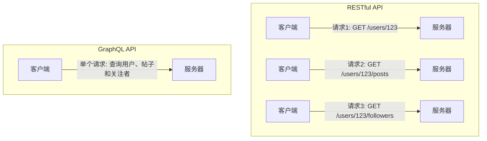
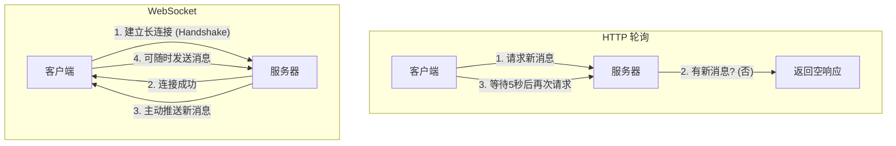
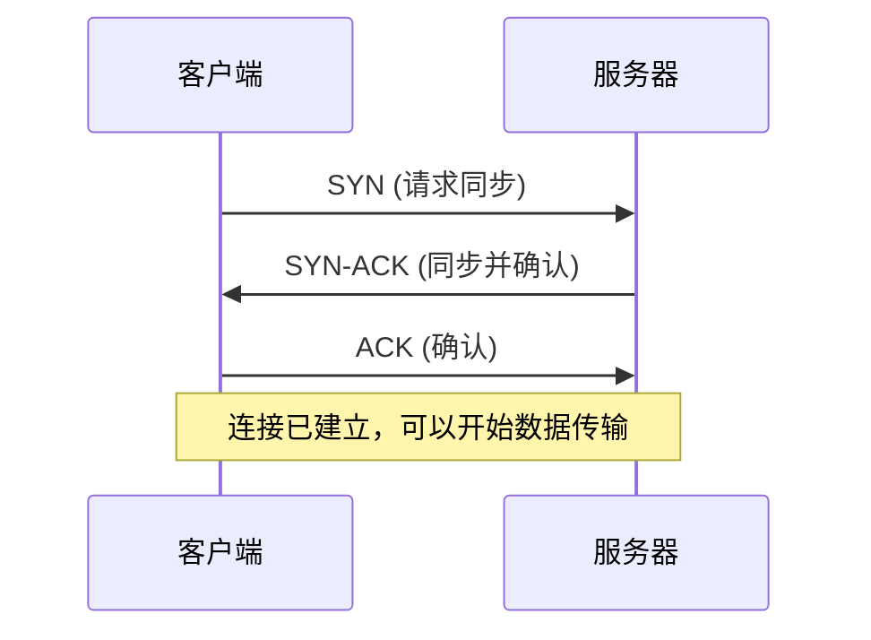
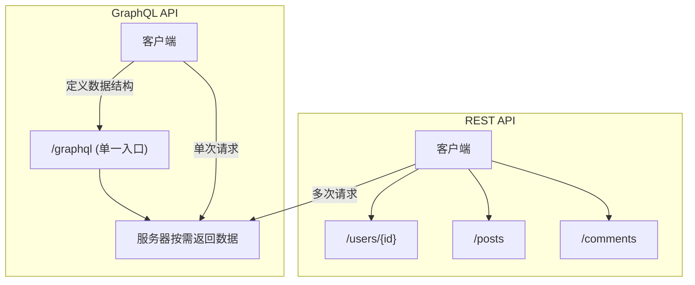
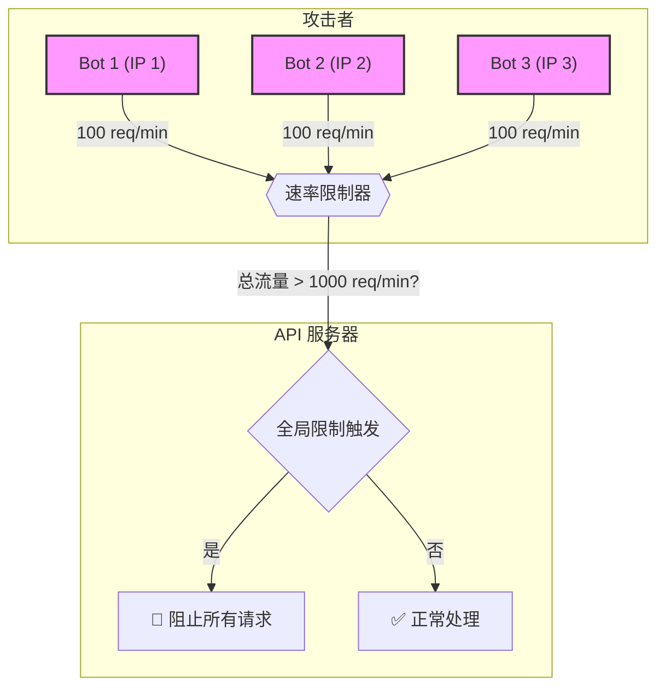

{{跨越初级与高级的鸿沟：API设计之道}}
在本课程中，你将学到那些区分初级与高级开发者的关键 API 设计技能。大多数开发者只知道如何构建基础的 CRUD API，但他们并不真正理解 API 在幕后的工作原理。例如，何时选择 REST 而不是 GraphQL？何时应采用 HTTP、WebSockets 或消息传递等不同的协议？以及如何应用核心的安全实践？(见 00:00:23)

这些问题正是在高级工程师面试中经常被问到的，也是我在真实世界项目中亲自应用的原则。我们将深入探讨 API 设计原则、协议、RESTful 与 GraphQL API 设计、身份验证、授权和安全实践——涵盖了从基础到高级所需的一切知识，帮助你像一位高级工程师一样思考。

> 如果你正困于初级到中级的职位，并渴望获得高级工程师的薪资，那么本课程所传授的知识将是你实现目标的关键助力。(见 00:00:53)

## 📖 API 基础：构建高效软件交互的基石

欢迎来到本节课程，我们将学习 API 设计的基本原则，这些原则将使你能够创建高效、可扩展且易于维护的软件系统间接口。

本节课将涵盖以下内容：
- **API 的定义**：它们是什么，以及在系统架构中扮演的角色。
- **主流 API 风格**：深入了解 REST、GraphQL 和 gRPC 这三种最常用的 API 风格。
- **卓越 API 的四大设计原则**：探索构建优秀 API 的核心准则。
- **应用协议的影响**：理解协议选择如何影响 API 的设计决策。
- **API 设计全流程**：从设计、开发到部署的完整生命周期。

### 什么是 API？

API 是**应用程序编程接口 (Application Programming Interface)** 的缩写，它定义了不同软件组件之间应该如何交互。(见 00:01:46) 想象一个场景：一边是用户正在使用的手机或浏览器（客户端），另一边是响应请求的服务器。API 在这里扮演着一份**契约**的角色，明确规定了以下条款：

1.  **可以发出哪些请求？** API 提供了一个接口，告诉我们如何发出请求，包括有哪些可用的端点 (endpoints)、可以使用哪些方法 (methods) 等。
2.  **可以期待什么响应？** 对于特定的请求，服务器会返回怎样的响应。

API 的核心作用体现在两个方面：

*   **抽象机制 (Abstraction Mechanism)**：API 隐藏了复杂的内部实现细节，只暴露必要的功能。例如，我们可以通过调用一个 API 来保存用户数据，而完全不需要关心服务器背后是如何处理这些数据、使用了什么数据库或算法。我们只关心那个暴露出来的端点。(见 00:02:41)
*   **设定服务边界 (Service Boundaries)**：API 在不同系统和组件之间定义了清晰的接口。这使得我们可以将系统拆分为多个微服务，例如一个服务负责用户管理，另一个负责帖子管理。这种解耦允许不同系统（如浏览器与服务器、服务器与服务器）进行通信，无论其底层技术实现如何。(见 00:03:05)

[小结] API 是一份定义软件交互规则的契约，它通过抽象隐藏实现细节，并通过设定清晰的边界促进了系统的模块化和解耦。

## 🚀 主流 API 风格深度解析

在设计阶段，你会遇到多种 API 风格，其中最重要的是 RESTful、GraphQL 和 gRPC。

### RESTful API：基于资源的经典范式

REST (Representational State Transfer) 是目前最常见的 API 风格。它采用一种**基于资源 (resource-based)** 的方法，并使用 HTTP 协议的方法进行操作。(见 00:03:37)

**核心特性**:
- **无状态 (Stateless)**：每个请求都包含处理它所需的所有信息，服务器不需要依赖之前的任何请求来处理当前请求。
- **标准 HTTP 方法**:
    - `GET`: 获取数据
    - `POST`: 创建数据
    - `PUT` / `PATCH`: 更新数据
    - `DELETE`: 删除数据

由于其特性，REST 通常是 Web 和移动应用的首选。

### GraphQL：为复杂前端量身定制的查询语言

GraphQL 是继 REST 之后第二流行的 API 风格。它是一种**查询语言**，允许客户端精确地请求其所需的数据。(见 00:04:24)

**核心特性**:
- **单一端点 (Single Endpoint)**：所有操作通常都通过一个端点（如 `/graphql`）进行。
- **客户端定义数据**: 客户端通过在请求的 payload 中指定查询结构，来决定自己想要获取哪些字段。
- **操作类型**:
    - `Query`: 用于检索数据。
    - `Mutation`: 用于修改数据（相当于 REST 中的 POST, PUT, PATCH）。
    - `Subscription`: 用于实时通信。

GraphQL 的最大优势在于**减少网络往返次数 (Round Trips)**。假设一个场景，在 REST 中需要发送三个请求才能获取到所有关联数据，而使用 GraphQL，只需一个请求就能全部搞定。因此，它特别适用于那些需要在单个页面上展示复杂、嵌套数据的用户界面 (UI)。(见 00:05:24)

### gRPC：面向微服务的高性能框架

gRPC 是一个高性能的远程过程调用 (RPC) 框架，它使用 **Protocol Buffers** 作为通信格式。(见 00:05:46) 它的普及度相对前两者较低，但应用场景非常明确。

**核心特性**:
- **高性能**: 在服务器间的通信效率远高于 REST 或 GraphQL。
- **支持流式与双向通信 (Streaming & Bi-directional communication)**。
- **强类型定义**: 方法在 `.proto` 文件中被定义为 RPCs。

gRPC 是微服务架构和内部系统通信的绝佳选择，因为它在性能上具有显著优势。(见 00:06:06)

### 案例对比：REST vs. GraphQL

为了更清晰地理解差异，我们来看一个具体的例子：获取用户及其帖子和关注者信息。

| 特性 | RESTful API | GraphQL API |
| :--- | :--- | :--- |
| **端点** | 多个资源导向的端点 | 单一端点（如 `/graphql`） |
| **请求示例** | 需要发送 **3 个** 独立的请求：<br>`GET /v1/users/123`<br>`GET /v1/users/123/posts`<br>`GET /v1/users/123/followers` | 只需发送 **1 个** 请求，并在查询中指定所有需要的数据。 |
| **数据获取** | **数据冗余 (Over-fetching)**：端点返回固定结构，可能包含不需要的数据。 | **精确获取 (Precise Fetching)**：客户端精确定义所需字段，杜绝数据冗余。 |
| **响应结构** | 服务器端固定 | 客户端定义 |
| **版本管理** | 显式版本控制，如 `/v1`, `/v2` | 通常通过演进 schema 来实现，无需硬性版本号，但也可对字段进行版本控制。 |
| **缓存** | 利用标准的 HTTP 缓存机制 | 更多依赖应用层缓存 |

(见 00:08:30)



[小结] REST、GraphQL 和 gRPC 各有其适用场景。REST 适合标准的 Web 应用，GraphQL 擅长处理复杂的前端数据需求，而 gRPC 则是内部微服务通信的性能利器。

## 🏛️ 卓越 API 的四大设计原则

一个好的 API，甚至可以做到让开发者无需阅读文档就能上手使用。如果一个 `GET /users/123` 的请求在获取用户详情的同时，还悄悄地修改了用户的关注者列表，这无疑是一个糟糕的设计，因为它违反了用户的直觉和预期。(见 00:09:55) 卓越的 API 设计遵循以下四大原则：

#### 1. 一致性 (Consistency)
在整个 API 中使用一致的命名、大小写规范和模式。例如，如果你在一个端点中使用了驼峰命名法 (`camelCase`)，就不应该在另一个端点中混用下划线命名法 (`snake_case`)。一致性让 API 变得可预测且易于学习。(见 00:10:07)

#### 2. 简洁性 (Simplicity)
专注于核心用例，追求直观的设计。应最大限度地降低复杂性，让开发者能够快速理解和使用。

> > 最好的 API 是开发者无需阅读文档就能使用的 API。

#### 3. 安全性 (Security)
安全性是 API 设计的基石。必须实施适当的**身份验证 (Authentication)** 和**授权 (Authorization)**机制。此外，对所有用户输入进行**验证 (Validation)**，并应用**速率限制 (Rate Limiting)** 来防止滥用，这些都是最基本的安全措施。(见 00:11:03)

#### 4. 高性能 (Performance)
为效率而设计。这包括采用合适的**缓存策略**、对大量数据进行**分页 (Pagination)** 处理、最小化**响应体负载 (Payload)**，以及在可能的情况下**减少网络往返次数**。例如，如果你知道客户端在获取A数据的同时几乎总会需要B数据，那么将B数据包含在A的响应中，可能比让客户端再发起一次请求更高效。(见 00:11:39)

## 🛠️ 协议选择与 API 设计流程

你的协议选择将从根本上塑造你的 API 设计。

### 协议如何塑造 API

不同的协议为 API 提供了不同的能力。
- **HTTP**: 其特性（如状态码、方法、头部）直接促成了 RESTful API 的能力。它也是 GraphQL 的常用协议。
- **WebSockets**: 提供了实时、双向的通信能力，非常适合聊天应用或视频流等需要实时数据交换的场景。(见 00:12:34)
- **gRPC 协议**: 专为高性能而生，使其成为微服务间通信的理想选择，速度远超 HTTP。

因此，你需要根据 API 的需求、限制和优势来选择最合适的协议。(见 00:13:08)

### API 的完整生命周期

API 的构建远不止编码那么简单，它是一个完整的生命周期过程。

1.  **需求与设计 (Requirements & Design)**
    - **理解需求**：识别核心用例、用户故事，并明确 API 的范围边界。
    - **确定性能与安全约束**：定义性能瓶颈和必须实施的安全措施。
    - **设计方法**：
        - **自顶向下 (Top-down)**：从高层需求和工作流开始，逐步细化到端点和操作。这在面试中很常见。
        - **自底向上 (Bottom-up)**：基于现有的数据模型和系统能力来设计 API。这在企业内部开发中更常见。(见 00:14:37)
        - **契约先行 (Contract-first)**：在实现任何代码之前，先定义好 API 的契约（请求和响应的结构）。这与自顶向下方法类似。

2.  **开发与部署 (Development & Deployment)**
    - **开发与本地测试**：根据设计和契约进行编码实现。
    - **部署与监控**：将 API 部署到预发布或生产环境，并进行持续监控和测试。(见 00:15:32)

3.  **维护与退役 (Maintenance & Retirement)**
    - **维护**：API 的简洁性和良好设计在此阶段至关重要，它决定了维护的难易程度。
    - **弃用与退役**：随着业务发展，API 可能会有新版本（如 V2 替代 V1），旧版本最终会被弃用和下线。(见 00:15:56)

[小结] 我们学习了 API 的定义、三大主流风格、四项核心设计原则以及完整的生命周期。接下来，我们将更深入地探讨各种 API 协议的优缺点，以帮助你根据具体需求做出明智的技术选型。仅仅高层次地了解这些原则还远远不够，在面试中，如果你只是纸上谈兵而没有实际项目经验，很容易被识破。对于拥有1到5年商业经验，并且身处美国、加拿大、欧洲、澳大利亚或新西兰的开发者而言，如果你正
在寻求职业突破，希望深入掌握 API 设计等高级概念并冲击高级工程师的薪资水平，那么可以考虑申请与我进行一对一的指导。在我的辅导项目中，我们正是通过在真实世界项目中动手实践这些概念，模拟顶级公司高级工程师的工作方式，帮助开发者实现职业跃迁。如果你对此感兴趣并准备好认真投入，可以通过描述中的第一个链接申请。但请注意，由于名额有限，我们只会筛选最合适的申请者。(见 00:18:05)

言归正传，为 API 选择错误的协议可能会导致性能瓶颈和功能限制。因此，我们必须首先深入理解这些协议，才能构建出满足用户在延迟、吞吐量和交互模式上特定需求的 API。

## 协议深度探索：为你的 API 选择合适的地基

在上一部分，我们了解了 API 的设计原则和生命周期。现在，我们将深入网络协议栈，探讨那些支撑着 API 运行的底层协议，包括 HTTP/S、WebSocket、AMQP 和 gRPC。

### 🌍 应用层协议：API 通信的语言

应用层协议位于网络协议栈的顶层，建立在传输层协议（如 TCP 和 UDP）之上。它们定义了消息的格式与结构、请求-响应模式、连接管理以及错误处理机制。当我们构建 API 时，主要关注的就是 HTTP、WebSocket 等应用层协议。(见 00:19:16)

#### HTTP: Web API 的基石

超文本传输协议（HTTP）是 Web API 的基础。典型的 HTTP 交互遵循一个简单的客户端-服务器模型：

1.  **客户端发起请求 (Request)**：客户端发送一个请求，其中包含：
    *   **方法 (Method)**：如 `GET`、`POST` 等，定义了操作类型。
    *   **资源 URL (Resource URL)**：指定要操作的资源路径，例如 `/api/products/123`。
    *   **HTTP 版本**：如 `HTTP/1.1`。
    *   **主机 (Host)**：服务器的域名。
    *   **头部 (Headers)**：包含元数据，如 `Authorization` 用于身份验证（例如 Bearer Token 或 Basic Auth）。(见 00:20:38)

2.  **服务器返回响应 (Response)**：服务器在处理完请求后，返回一个响应，其中包含：
    *   **状态码 (Status Code)**：表示请求结果，如 `200` (成功)、`400` (客户端错误)、`500` (服务器错误)。
    *   **头部 (Headers)**：包含响应的元数据，如 `Content-Type` (通常是 `application/json`) 和 `Cache-Control` (用于缓存控制)。
    *   **正文 (Body)**：实际返回的数据。

**核心 HTTP 方法与状态码**

为了更好地理解 HTTP，我们可以将其核心方法和状态码归纳如下：

| 类别 | 描述 |
| :--- | :--- |
| **HTTP 方法** | |
| `GET` | 检索数据 |
| `POST` | 创建新数据 |
| `PUT` / `PATCH` | 完全或部分更新现有数据 |
| `DELETE` | 删除数据 |
| **状态码系列** | |
| **2xx** (成功) | 请求已成功被服务器接收、理解、并接受。 |
| **3xx** (重定向) | 需要后续操作才能完成这一请求。 |
| **4xx** (客户端错误) | 请求含有词法错误或者无法被执行。 |
| **5xx** (服务器错误) | 服务器在处理一个有效请求时发生错误。 |

[小结] HTTP 以其无状态和基于资源的特性，成为了构建绝大多数 Web API 的首选。它的请求-响应模式简单明了，易于理解和实现。(见 00:22:02)

#### HTTPS: 安全的加密通道

HTTPS 本质上就是增加了 TLS/SSL 加密层的 HTTP。它通过证书和加密算法，确保了数据在客户端和服务器之间传输时的安全性，有效防止了数据在传输过程中被窃听或篡改。

> 如今，在生产环境中使用 HTTPS 已是黄金标准。它不仅能加密数据、保证数据完整性、验证用户身份，还能带来一定的 SEO 优势。(见 00:22:45)

### ⚡ 实时通信的选择：WebSocket

对于需要实时数据交互的应用（如在线聊天、股票行情、实时协作工具），传统的 HTTP 轮询模式存在明显弊端：

*   **高延迟**：客户端需要不断发送请求才能获取最新数据。
*   **带宽浪费**：即使没有新数据，请求和空响应也会消耗网络带宽。
*   **服务器资源消耗**：频繁的无效请求会给服务器带来不必要的压力。(见 00:24:06)

为了解决这些问题，WebSocket 应运而生。它提供了一种在单个 TCP 连接上进行全双工通信的协议。



通过一次初始“握手”建立连接后，服务器和客户端之间便形成了一条持久化的双向通信通道。服务器可以随时主动向客户端推送数据，而无需等待客户端的请求。这极大地降低了延迟，减少了不必要的网络流量，是构建实时应用的理想选择。(见 00:25:06)

### 🔄 异步解耦的利器：AMQP

高级消息队列协议 (Advanced Message Queuing Protocol, AMQP) 是一种用于企业级消息传递的协议，旨在实现可靠的异步通信和消息保证交付。(见 00:25:46)

其核心架构通常包括三个角色：

1.  **生产者 (Producer)**：消息的创建者，例如一个下单服务或支付系统。它将消息发布到消息代理。
2.  **消息代理 (Message Broker)**：负责接收、存储和路由消息。其内部包含多个**队列 (Queue)**，用于暂存不同类型的消息（如“订单处理队列”）。
3.  **消费者 (Consumer)**：消息的处理者，例如一个库存更新服务或通知系统。

这种模式的巨大优势在于**解耦**和**削峰填谷**。生产者只需将消息发送到队列即可，无需关心消费者何时或如何处理。消费者则可以在自身有处理能力时，从队列中拉取消息进行处理。如果消费者暂时繁忙，消息会安全地存放在队列中，等待后续处理，从而保证了系统的稳定性和弹性。(见 00:26:42)

### 🚀 高性能内部通信：gRPC

gRPC 是由 Google 开发的一个高性能、开源的远程过程调用 (RPC) 框架。它使用 HTTP/2 作为传输协议，并默认使用 Protocol Buffers 作为接口定义语言。

其主要特点和应用场景包括：

*   **高性能**：基于 HTTP/2 的多路复用、头部压缩等特性，通信效率远高于基于 HTTP/1.1 的 REST API。
*   **强类型契约**：使用 Protocol Buffers 定义服务接口，可以生成多语言的客户端和服务器代码，保证了类型安全。
*   **流式处理**：内置支持双向流，可以处理复杂的数据流场景。
*   **内部通信**：由于其高性能特性和部分浏览器兼容性问题，gRPC 主要用于**微服务之间的内部通信**，即服务器与服务器之间的调用。(见 00:27:32)

### 🤔 如何选择合适的应用层协议？

选择正确的协议需要综合考虑多个因素：

| 考虑因素 | 建议协议 | 场景示例 |
| :--- | :--- | :--- |
| **交互模式** | HTTP/S | 传统的请求-响应，如获取文章、提交表单。 |
| | WebSocket | 实时双向通信，如在线聊天、实时仪表盘。 |
| | AMQP | 异步任务、系统解耦，如订单处理、日志收集。 |
| **性能要求** | gRPC | 微服务间高吞吐量、低延迟的内部通信。 |
| **客户端兼容性** | HTTP/S, WebSocket | 几乎所有现代浏览器和客户端都支持。 |
| | gRPC | 主要用于服务器端，浏览器支持有限。 |
| **其他因素** | Payload 大小、安全需求、开发体验、团队熟悉度等。 |

[小结] 每种协议都有其最擅长的领域。默认情况下，HTTP/S 是最通用的选择。但当面临实时、异步或高性能内部通信的挑战时，WebSocket、AMQP 和 gRPC 则是更优的解决方案。(见 00:29:09)

## 输送管道的选择：TCP vs. UDP

我们刚才讨论的 HTTP、WebSocket 等协议都位于应用层，但它们的数据包究竟是如何在网络中传输的呢？这就要深入到 OSI 模型的传输层，了解两大核心协议：TCP 和 UDP。(见 00:30:24)

### TCP (传输控制协议): 可靠但稍慢的伙伴

你可以将 TCP 想象成一次需要签收和追踪的快递服务。它是一种面向连接的、可靠的传输协议。

*   **可靠性保证**：TCP 确保所有数据包都能准确无误地到达目的地。它通过序列号、确认应答 (ACK) 和重传机制来实现。如果一个数据包丢失或乱序到达，TCP 会负责重传或重排，确保数据最终的完整性和正确性。(见 00:31:28)
*   **面向连接**：在发送数据之前，TCP 需要通过著名的“三次握手”在客户端和服务器之间建立一个稳定的连接。
*   **流量控制与拥塞控制**：TCP 能够根据网络状况调整发送速率，避免网络拥塞。

这种对可靠性的极致追求也带来了一些开销，使其速度相对较慢。因此，TCP 非常适用于那些对数据完整性要求极高的场景，如**网页浏览 (HTTP/S)、文件传输、支付和用户身份验证**。(见 00:32:08)

### UDP (用户数据报协议): 快速但不保证送达的先锋

与 TCP 相反，UDP 像是一种普通的平信邮寄服务——快速、简单，但不提供任何送达保证。它是一种无连接的、不可靠的协议。

*   **高效快速**：UDP 省去了建立连接和保证可靠性的复杂开销，数据包的封装和发送过程非常简单，因此传输速度非常快。
*   **不可靠性**：UDP 不保证数据包的送达、不保证顺序、也不进行错误恢复。如果数据包在传输过程中丢失，UDP 不会进行任何处理。(见 00:32:38) 这种“尽力而为”的交付方式
使得 UDP 成为对实时性要求高、但能容忍少量数据丢失的场景的理想选择。(见 00:32:44) 例如，在视频通话或在线游戏中，如果某个数据包（对应一帧画面或一个位置信息）丢失了，系统没必要为了找回它而中断整个流畅的体验，直接继续传输新的数据包是更好的策略。

> **核心应用场景**：
> *   **视频通话与直播**：偶尔的画面跳跃或模糊可以接受，但卡顿和延迟是致命的。
> *   **在线游戏**：玩家的实时位置和动作更新需要极低延迟，丢失一个旧的位置包影响不大。
> *   **DNS 查询**：一次快速的查询，如果失败，重新查询的成本很低。

#### TCP 的三次握手图解 🤝

为了更直观地理解 TCP 的可靠性从何而来，我们可以回顾一下其标志性的“三次握手”连接建立过程。(见 00:33:31)



这个过程确保了在任何数据交换开始之前，客户端和服务器双方都已准备就绪，并且网络路径是通畅的。

#### TCP vs. UDP：如何抉择？

总而言之，TCP 和 UDP 的选择取决于你的应用需求。

| 特性 | TCP (传输控制协议) | UDP (用户数据报协议) |
| :--- | :--- | :--- |
| **可靠性** | **高** (保证送达、保证顺序) | **低** (不保证送达，尽力而为) |
| **连接性** | 面向连接 (三次握手) | 无连接 |
| **速度** | 较慢 (因开销较大) | **非常快** (开销极小) |
| **流量控制** | 有 (拥塞控制) | 无 |
| **适用场景** | 银行、邮件、支付、网页浏览 | 视频直播、在线游戏、DNS |

(见 00:34:35) 如果你需要一个安全可靠的连接，那么选择 TCP；如果你追求极致的速度和低延迟，并且可以接受少量数据丢失，那么 UDP 是不二之选。了解了应用层和传输层这些关键协议后，我们就掌握了构建 API 所需的基础网络知识。

[小结] 传输层协议的选择直接影响 API 的性能和可靠性。TCP 以其可靠性成为大多数数据完整性要求高的 API 的首选，而 UDP 则在实时通信领域大放异彩。

## 深入剖析 RESTful API 设计

在前面的章节中，我们已经对 REST (Representational State Transfer) 有了初步的了解。现在，我们将深入探讨如何设计出清晰、一致且易于维护的 RESTful API。它是迄今为止开发者构建和使用 API 最为普遍的方式。(见 00:35:24)

### 核心理念：以资源为中心 🏛️

REST 的核心是**资源 (Resource)**。在设计 API 时，我们首先要识别出系统中的核心业务概念，并将它们建模为资源。

> 一个关键原则是：**使用名词（Nouns）而非动词（Verbs）来命名资源。**

例如，在一个电商系统中，我们的核心概念是“产品 (Product)”、“订单 (Order)”和“评论 (Review)”。在 RESTful API 中，它们会分别对应资源路径：`/products`、`/orders` 和 `/reviews`。(见 00:36:19)

资源可以分为两种类型：
1.  **集合 (Collection)**：代表一组资源。例如，`GET /api/products` 会返回所有产品的列表。
2.  **单个条目 (Individual Item)**：代表一个特定的资源。例如，`GET /api/products/{productId}` 会返回 ID 为 `productId` 的那个特定产品。

请注意，我们使用的是 `/products` 而不是 `/getProducts`。操作的类型（获取、创建、更新、删除）应该由 HTTP 方法来定义，而不是体现在 URL 中。

### URL 设计：清晰的资源定位 🗺️

一个好的 URL 设计应该像地图一样清晰，能够直观地反映出资源的结构和关系。

*   **获取集合**: `GET /api/v1/orders` - 获取所有订单。
*   **获取特定项**: `GET /api/v1/orders/123` - 获取 ID 为 123 的订单。
*   **嵌套资源**: 对于有明确层级关系的资源，可以使用嵌套路径来表达。例如，要获取某个特定产品的所有评论，一个直观的 URL 就是：
    `GET /api/v1/products/456/reviews` (见 00:37:38)

这种设计使得 API 的结构一目了然，使用者可以轻松地推断出如何访问相关资源。

### 高级功能：筛选、排序与分页 ⚙️

在真实世界的应用中，一次性返回成千上万条数据是低效且不切实际的。因此，必须为 API 提供筛选、排序和分页的能力。这些功能通常通过 **URL 查询参数 (Query Parameters)** 来实现。(见 00:38:01)

#### 筛选 (Filtering)

允许客户端根据特定条件来减少返回结果的数量。
*   **示例**：只获取“电子产品”类别下有库存的商品。
    ```
    GET /api/v1/products?category=electronics&in_stock=true
    ```
    (见 00:38:18) 这样做可以极大地节省带宽，并提升前后端的处理性能。

#### 排序 (Sorting)

允许客户端指定返回结果的排列顺序。
*   **示例**：按价格升序或降序排列商品。
    ```
    GET /api/v1/products?sort=price_asc  // 升序
    GET /api/v1/products?sort=reviews_desc // 按评论数降序
    ```
    (见 00:38:54) 排序操作应该在后端（数据库层面）完成，而不是将成千上万条未排序的数据返回给前端再处理，这样效率更高。

#### 分页 (Pagination)

当结果集非常大时，分页是必不可少的。它允许客户端按“页”来分批获取数据。
*   **基于页码 (Page-based)**：最常见的方式，通过 `page` 和 `limit`（或 `size`）参数控制。
    ```
    GET /api/v1/products?page=2&limit=20
    ```
    这表示获取第二页的数据，每页包含 20 个条目。(见 00:39:52)
*   **基于偏移量 (Offset-based)**：与页码类似，但更灵活。`offset` 指示从哪里开始，`limit` 指示获取多少个。
    ```
    GET /api/v1/products?offset=20&limit=20
    ```
    这表示跳过前 20 个条目，然后获取接下来的 20 个。
*   **基于游标 (Cursor-based)**：通过一个不透明的“游标”（通常是上一页最后一条记录的标识）来定位下一页，这种方式在处理实时更新的数据集时性能更好，可以避免页码分页中常见的重复或遗漏问题。(见 00:41:01)

[小结] 筛选、排序和分页是现代 API 的标配，它们赋予了客户端极大的灵活性，显著提升了性能并节省了网络资源。

### HTTP 方法：定义资源操作 (CRUD) 🔨

RESTful API 充分利用 HTTP 协议本身，使用不同的 HTTP 方法来对应资源的不同操作，即我们常说的 **CRUD** (Create, Read, Update, Delete)。(见 00:41:34)

| HTTP 方法 | 操作 | 目标资源 | 幂等性 (Idempotent) | 描述 |
| :--- | :--- | :--- | :--- | :--- |
| `GET` | **读取 (Read)** | 集合或单个资源 | ✅ 是 | 安全且幂等。多次调用返回相同结果（除非资源被修改）。示例：`GET /products/123`。 |
| `POST` | **创建 (Create)** | 集合 | ❌ 否 | 非幂等。每次调用都会创建一个新资源。示例：`POST /products`，请求体中包含新产品信息。 |
| `PUT` | **更新/替换 (Update)** | 单个资源 | ✅ 是 | 幂等。用请求体中的数据**完全替换**目标资源。多次调用效果相同。示例：`PUT /products/123`。 |
| `PATCH` | **部分更新 (Update)** | 单个资源 | ❌ 否 | 通常非幂等。只更新请求体中提供的字段，其他字段保持不变。示例：`PATCH /products/123`，请求体中只包含 `{"price": 99.99}`。 |
| `DELETE` | **删除 (Delete)** | 单个资源 | ✅ 是 | 幂等。删除指定资源。多次调用，结果都是该资源不存在。示例：`DELETE /products/123`。 |

**幂等性 (Idempotency)** 是一个重要概念，它指的是执行一次和执行多次相同的请求，对服务器状态产生的影响是相同的。(见 00:42:13) 这对于构建可靠的、可重试的系统至关重要。例如，如果一个 `PUT` 请求因网络问题超时，客户端可以安全地重试，而不必担心会产生副作用。

### 状态码与错误处理：有效的沟通 🚦

API 不仅要在成功时返回数据，更要在出现问题时提供清晰的反馈。HTTP 状态码就是 API 与客户端之间沟通的语言。(见 00:44:48)

*   **2xx (成功)**
    *   `200 OK`: 请求成功。适用于 `GET` 和 `PUT`/`PATCH` 成功的响应。
    *   `201 Created`: 资源创建成功。适用于 `POST` 请求，通常响应体中会包含新创建的资源及其 URL。 (见 00:45:36)
    *   `204 No Content`: 请求成功，但没有内容返回。适用于 `DELETE` 请求。

*   **3xx (重定向)**
    *   `301 Moved Permanently`: 资源已被永久移动到新的 URL。

*   **4xx (客户端错误)**
    *   `400 Bad Request`: 通用客户端错误，如请求参数无效、JSON 格式错误等。(见 00:46:36)
    *   `401 Unauthorized`: 用户未认证，需要登录。
    *   `403 Forbidden`: 用户已认证，但无权访问该资源。
    *   `404 Not Found`: 请求的资源不存在。(见 00:46:56)

*   **5xx (服务器错误)**
    *   `500 Internal Server Error`: 服务器内部发生未知错误。这通常是代码中的 bug 导致的，应避免直接将堆栈跟踪等敏感信息暴露给客户端。

[小结] 合理使用 HTTP 状态码和提供结构化的错误信息，是构建健壮、易于调试的 API 的关键一环。

### REST API 设计最佳实践 ✨

除了上述核心原则，遵循一些社区公认的最佳实践可以让你的 API 更加专业和易用。

#### 使用复数名词

如前所述，资源的 URL 应该使用复数形式，例如 `/products` 而不是 `/product`。这已经成为一种事实标准，因为它能更自然地表示资源集合。(见 00:47:28) 无论是获取集合 (`GET /products`) 还是获取单个资源 (`GET /products/123`)，都使用统一的复数形式，保持了一致性。

#### 采用一致的
的 HTTP 方法和 URL 结构。例如，删除用户应该使用 `DELETE` 方法请求 `/users/{id}`，而不是用 `POST` 方法请求一个自定义的 `/users/delete/{id}` 路径。(见 00:47:53) 混乱的动词和不规范的路径会严重破坏 API 的可预测性。

#### 支持高级功能 🚀

一个设计良好的 REST API 不应仅限于基础的 CRUD 操作。它还应该提供强大的高级功能，以方便客户端使用。

*   **筛选 (Filtering)**: 允许客户端根据特定条件过滤资源集合。
*   **排序 (Sorting)**: 允许客户端指定返回结果的排序依据，如按价格、评分等排序。(见 00:48:37)
*   **分页 (Pagination)**: 当资源集合很大时，通过分页返回部分数据，避免一次性加载过多内容，并允许客户端控制每页数量（limit）和页码（page）。

这些功能极大地提升了 API 的灵活性和性能，让客户端可以精确地获取所需数据。

#### API 版本管理 (Versioning) 🏷️

随着业务的发展，API 必然会发生变化。为了在不破坏现有客户端应用的前提下引入新功能或进行重大修改，版本管理至关重要。

> **最佳实践**：在 URL 中明确包含版本号，如 `/api/v1/products`。

这种方式非常直观。当你要发布一个不兼容的 V2 版本时，旧的客户端可以继续使用 `/api/v1`，而新的客户端则可以迁移到 `/api/v2`。这确保了平滑过渡，避免了因 API 升级导致线上服务中断。(见 00:49:05) 新旧版本可以并行存在，直到旧版本被正式弃用。

[小结] 至此，我们深入探讨了 REST 架构的原则、资源建模、URL 设计、状态码与错误处理，以及一系列提升 API 质量的最佳实践。掌握这些理论是构建优秀 API 的起点，但真正的精通来源于实践。将这些概念应用到真实项目中，才能将其内化为自己的能力。(见 00:50:06)

## 深入剖析 GraphQL：为现代应用而生的查询语言

尽管 RESTful API 功能强大且应用广泛，但它也存在固有的痛点：**数据冗余获取 (Over-fetching)** 和 **数据获取不足 (Under-fetching)**。前者指 API 返回了比客户端实际需要更多的字段，后者则指客户端需要调用多个端点才能拼凑出视图所需的所有数据。

为了解决这些问题，Facebook 于 2015 年推出了 GraphQL。它不是一种架构风格，而是一种 API 查询语言和运行时。(见 00:51:28)

### 为什么需要 GraphQL？解决 REST 的痛点 🎯

想象一下 Facebook 的主页，需要展示用户信息、帖子列表、每条帖子的评论和点赞数。如果使用 REST API，客户端可能需要发起多个请求：
1.  `GET /users/{id}` 获取用户信息。
2.  `GET /users/{id}/posts` 获取用户的帖子列表。
3.  `GET /posts/{postId}/comments` 获取每条帖子的评论。
4.  `GET /posts/{postId}/likes` 获取每条帖子的点赞信息。

这种瀑布式的请求会显著增加页面加载的延迟。(见 00:52:23) 而 GraphQL 通过提供一个单一的端点（通常是 `/graphql`），允许客户端在一个请求中精确声明其所需数据的结构和字段，从而一举解决了上述问题。



### 核心基石：Schema 与类型系统 📜

GraphQL 的核心是其**强类型 Schema（模式）**。Schema 是客户端与服务器之间的契约，它精确定义了 API 的能力。

*   **类型 (Type)**: 定义了可以从 API 中查询的对象及其字段。例如，你可以定义一个 `User` 类型，包含 `id`, `name`, `posts` 等字段。(见 00:53:20) 如果字段本身是复杂对象（如 `posts` 是一个 `Post` 数组），你可以继续定义 `Post` 类型。
*   **查询 (Query)**: 定义了所有可用的数据读取操作，类似于 REST 中的 `GET` 请求。每个查询都有一个名称和返回类型，例如 `user(id: ID!): User` 表示一个根据 ID 获取用户的查询。 (见 00:53:39)
*   **变更 (Mutation)**: 定义了所有数据写入操作，涵盖了 REST 中的 `POST`, `PUT`, `PATCH`, 和 `DELETE`。例如，`createUser(name: String!): User` 表示一个创建新用户的操作。(见 00:54:04)

一个设计良好、直观且灵活的 Schema 是成功 GraphQL API 的关键。

### 数据交互：查询 (Query) 与变更 (Mutation) ↔️

定义好 Schema 后，客户端就可以开始与 API 交互了。

*   **查询数据**: 客户端发送一个与 Schema 结构匹配的查询请求。例如，只请求用户的姓名和其帖子的标题，服务器就会返回一个结构完全相同的 JSON 对象，不多不少。(见 00:54:51)
*   **变更数据**: 客户端发送一个变更请求，并可以立即在同一个请求中查询变更后的数据。例如，在创建一个新帖子后，可以立即请求返回新帖子的 `id` 和 `title`。(见 00:55:15)

### 独特的错误处理机制 ⚠️

与 REST API 通过不同的 HTTP 状态码来表示成功或失败不同，GraphQL API 通常**总是返回 `200 OK` 状态码**，即使操作中发生了错误。(见 00:55:34)

错误信息会被包含在响应体的 `errors` 字段中。这种设计允许服务器在部分数据获取成功、部分失败的情况下，依然能返回成功获取的数据。`errors` 数组中的每个错误对象通常会包含错误信息、路径以及自定义的错误代码，帮助客户端精确定位问题。(见 00:55:51)

### GraphQL 设计最佳实践 🌟

1.  **保持 Schema 模块化**: 将大的 Schema 分解为多个小的、可复用的模块。
2.  **避免深度嵌套**: 过深的查询会给服务器带来性能压力。通常会通过设置“查询深度限制”（Query Depth Limit）来防止无限嵌套查询。(见 00:56:36)
3.  **使用有意义的命名**: 清晰的类型和字段命名对客户端和服务器端的开发者都至关重要。
4.  **为变更使用 Input 类型**: 将创建或更新操作所需的多个参数组合成一个 `Input` 类型，使变更操作更清晰、更易于扩展。

[小结] GraphQL 通过其声明式的数据获取方式、强类型的 Schema 和单一入口点，为现代前端应用提供了强大的数据交互能力，有效解决了 REST API 在复杂场景下的局限性。

## API 安全基石：认证 (Authentication) 🔐

在系统提供任何服务或限制任何操作之前，它首先需要知道请求者的身份。这就是**认证 (Authentication)** 的作用。

### 认证：你是谁？

> 认证的核心问题是：“你是谁？” 它负责验证尝试访问系统的用户或服务的身份是否合法。(见 00:57:36)

当用户或服务发起登录请求时，认证系统会验证其凭据。如果验证通过，则授予访问权限；如果失败，则拒绝请求，通常返回 `401 Unauthorized` 错误。认证是授权（Authorization，即“你能做什么？”）的第一步，也是整个安全体系的入口。

### 认证机制的演进 🚶‍♂️➡️🏃‍♂️

随着技术的发展，Web 应用的认证机制也经历了从简单到复杂的演进。

#### 1. 基本认证 (Basic Authentication)

这是最古老的认证方式之一。客户端将“用户名:密码”字符串进行 Base64 编码，并放在 HTTP 的 `Authorization` 头中发送。这种方式虽然简单，但 Base64 编码极易被逆向破解，因此非常不安全，除非全程使用 HTTPS 加密。(见 00:58:30) 如今，它已很少在公开应用中使用，仅偶尔见于内部工具。

#### 2. 不记名令牌 (Bearer Tokens)

这是现代 API 设计的标准方法。用户登录成功后，服务器会颁发一个访问令牌（Access Token）。客户端在后续的每次请求中，都需要在 `Authorization` 头中携带这个令牌（通常格式为 `Bearer <token>`）。(见 00:58:50) API 服务器接收到请求后，只需验证令牌的有效性即可，无需再次查询数据库验证用户信息。这种方式是**无状态的 (Stateless)**，因此速度快，易于水平扩展。(见 00:59:14)

#### 3. OAuth 2.0 与 JWT (JSON Web Tokens)

OAuth 2.0 是一个授权协议，允许用户通过受信任的第三方提供商（如 Google、GitHub）登录应用，而无需将自己的密码直接暴露给该应用。(见 00:59:29)

当用户通过第三方登录后，该提供商会向我们的应用颁发一个 **JWT (JSON Web Token)**。JWT 是一个经过签名的、紧凑的 JSON 对象，其中包含了用户的基本信息（如用户ID、邮箱）和令牌的元数据（如过期时间）。(见 00:59:49) 我们的 API 拿到 JWT 后，可以验证其签名以确认令牌的真实性，并解析其中的信息来识别用户。JWT 本身也是无状态的，完美契合了现代微服务架构。

#### 4. 访问令牌 (Access Token) 与刷新令牌 (Refresh Token)

为了进一步提升安全性，现代系统普遍采用双令牌机制：

*   **访问令牌 (Access Token)**: 生命周期很短（如15分钟），用于访问受保护的 API 资源。由于其有效期短，即使被窃取，攻击者能够造成的损害也有限。(见 01:00:32)
*   **刷新令牌 (Refresh Token)**: 生命周期较长（如几天或几个月），唯一的作用是当访问令牌过期时，用来静默地获取一个新的访问令牌。(见 01:00:46)

这种机制让用户可以保持长时间登录状态，而系统又能通过频繁轮换访问令牌来维持高安全性。刷新令牌通常被安全地存储在服务器端或客户端的 HttpOnly Cookie 中，以防止泄露。

#### 5. 单点登录 (SSO) 与身份协议

**单点登录 (Single Sign-On, SSO)** 允许用户只需登录一次，就可以访问多个相互信任的应用系统。(见 01:01:16) 例如，登录 Google 账号后，你可以无缝访问 Gmail、Google Drive 和 Google Calendar。

SSO 的实现依赖于标准的**身份协议**，最主流的两种是：
*   **SAML (Security Assertion Markup Language)**: 基于 XML，是企业级和遗留系统中非常流行的协议。
*   **OAuth 2.0 / OpenID Connect (OIDC)**: 基于 JSON，是现代 Web 和移动应用的首选。OIDC 是在 OAuth 2.0 之上构建的一个身份层，专门用于认证。

这些协议定义了不同应用之间如何安全地交换用户登录信息。

[小结] 认证是确认用户身份的过程，是安全的第一道防线。从简单的基本认证到复杂的 SSO 体系，认证技术不断演进，以在便利性和安全性之间找到最佳平衡。然而，确认了“你是谁”之后，我们还需要解决“你能做什么”的问题，这便是下一步要讨论的授权（Authorization）。


---

## API 安全进阶：授权与防护 🛡️

认证解决了“你是谁”的问题，但一个完整的安全体系还需要回答“你能做什么”。这就是授权（Authorization）的核心任务。一旦系统确认了用户的身份，下一步就是根据其权限，决定他可以访问哪些资源、执行哪些操作。

> 授权是在认证成功后进行的步骤，它精确控制用户在系统内的行为范围，是保障系统数据安全和隐私的关键。 (见 01:04:19)

### 授权 (Authorization)：三大核心模型

系统管理权限的方式多种多样，但主要可以归结为以下三种主流的授权模型。

#### 1. 基于角色的访问控制 (RBAC - Role-Based Access Control)

这是最常见、最直观的授权模型。系统预先定义好不同的**角色（Roles）**，每个角色绑定了一套固定的**权限（Permissions）**，而用户则被分配到相应的角色中。

*   **管理员 (Admin)**: 拥有完全控制权，可以创建、读取、更新、删除 (CRUD) 任何资源，并管理其他用户。
*   **编辑者 (Editor)**: 可以创建和修改内容，但通常没有删除权限或用户管理权限。
*   **查看者 (Viewer)**: 只有只读权限，不能对数据进行任何修改。

一个典型的例子就是 GitHub 的仓库权限管理 (见 01:07:03)。你可以将协作者设置为拥有写入权限的 `contributor`，或只有读取权限的 `viewer`，而仓库所有者则是拥有最高权限的 `admin`。RBAC 模型因其结构清晰、易于管理，在绝大多数团队协作工具、内容管理系统 (CMS) 中都得到了广泛应用。

#### 2. 基于属性的访问控制 (ABAC - Attribute-Based Access Control)

ABAC 是一种更精细、更灵活的授权模型，它超越了固定的“角色”概念，通过一系列**属性（Attributes）**来动态地决定访问权限。这些策略可以非常复杂，组合了多种条件。

*   **用户属性**: 如用户的部门（`department: "HR"`）、职位、年龄等。
*   **资源属性**: 如文档的保密级别（`confidentiality: "Internal"`）、所有者等。
*   **环境属性**: 如访问时间（`time: "WorkingHours"`）、地理位置、设备类型等。

**策略示例**：只有当 `用户的部门是HR` **并且** `资源的分类是内部` **并且** `访问时间是工作日` 时，才授予读取权限。 (见 01:08:13)

ABAC 提供了无与伦比的灵活性，能够实现非常复杂的访问控制逻辑。但其复杂性也带来了更高的管理成本和策略冲突的风险。

#### 3. 访问控制列表 (ACL - Access Control Lists)

ACL 是一种以**资源为中心**的授权模型。每个受保护的资源都附带一个列表，明确记录了哪些用户（或用户组）可以对其执行哪些操作。

**示例**：对于一个名为 `Project_Alpha.docx` 的文档，其 ACL 可能如下：
*   `Alice`: `Read`, `Write`
*   `Bob`: `Read`
*   `Charlie`: `No Access`

Google Drive 就是 ACL 的一个典型应用 (见 01:10:32)。当你分享一个 Google Doc 时，你可以精确到为每一个协作者单独设置“查看者”、“评论者”或“编辑者”权限。这种模型对特定资源的权限控制非常精确，但当用户和对象数量达到百万级别时，管理和扩展会变得非常困难。

[小结] 真实世界的系统往往不会拘泥于单一模型，而是将它们组合使用，以兼顾管理的便捷性和控制的灵活性。例如，一个系统可能以 RBAC 为基础，再通过 ABAC 添加额外的动态访问策略。

### 授权的实现机制

模型定义了“规则”，而技术则负责“执行”。OAuth 2.0 和 JWT 等技术在授权流程中扮演着至关重要的角色。

*   **OAuth 2.0：委托授权**
    OAuth 2.0 是一个用于**委托授权**的开放标准。它允许用户授权一个第三方应用访问他们存储在另一个服务上的信息，而无需将用户名和密码直接暴露给该第三方应用。 (见 01:11:15)

    例如，当你授权 Vercel 访问你的 GitHub 仓库以进行自动部署时，你并没有把 GitHub 密码给 Vercel。相反，GitHub 会向 Vercel 颁发一个具有特定权限（如读取仓库、创建部署）的**访问令牌 (Access Token)**。OAuth 2.0 定义了安全获取和验证这些令牌的标准流程。

*   **基于令牌的授权 (JWT)**
    当用户通过认证后，服务器会颁发一个令牌（通常是 JWT），这个令牌就像一张数字身份证。它包含了用户的关键信息，如 `userID`、`roles`（角色）、`scopes`（权限范围）等。 (见 01:13:02)

    在后续的每一次 API 请求中，客户端都会在请求头中携带这个令牌。服务器在处理请求前，会首先验证令牌的有效性，然后解析其中的信息，根据 RBAC 或 ABAC 等授权模型来判断该请求是否被允许。

> **关键区别**：RBAC/ABAC/ACL 是定义“谁能做什么”的**授权模型**。而 OAuth 2.0 和 JWT 则是承载身份和权限信息、并执行这些规则的**技术机制**。

### API 纵深防御：七大安全策略 ⚔️

API 是通往系统内部的大门，如果疏于防范，攻击者便可长驱直入。除了认证和授权，以下七种经过验证的安全技术能帮你构建一个更安全的 API 防线。

#### 1. 速率限制 (Rate Limiting)

速率限制用于控制客户端在给定时间窗口内可以发出的请求数量，是抵御暴力破解和拒绝服务 (DoS) 攻击的第一道防线。 (见 01:15:05)

*   **限制级别**：可以按用户、IP 地址、API 端点或全局进行设置。例如，限制每个用户每分钟只能调用登录接口 5 次。
*   **防御 DDoS**：虽然单个攻击者会被速率限制挡住，但分布式拒绝服务 (DDoS) 攻击会利用大量“僵尸网络”从不同 IP 同时发起攻击。因此，设置一个**全局速率限制**也至关重要，当总请求量超过系统承载极限时，可以临时阻止所有新请求，保护核心服务。



#### 2. 跨源资源共享 (CORS)

CORS (Cross-Origin Resource Sharing) 是一种浏览器安全机制，用于控制哪个**域名 (Origin)** 的前端应用可以通过浏览器调用你的 API。 (见 01:17:27) 如果你的 API 只为 `app.yourdomain.com` 服务，就应该配置 CORS 策略，拒绝所有来自其他域名（如 `malicious-site.com`）的请求，防止恶意网站诱导用户浏览器发起非预期的请求。

#### 3. SQL / NoSQL 注入防护

注入攻击发生在当用户输入被不安全地直接拼接到数据库查询语句中时。攻击者可以构造恶意的输入，从而绕过验证、读取敏感数据，甚至删除整个数据库。 (见 01:18:06)

**永远不要**直接拼接字符串来构造查询。请始终使用**参数化查询 (Parameterized Queries)** 或 ORM (对象关系映射) 框架提供的安全方法，它们能确保用户输入被当作纯粹的数据处理，而不是可执行的代码。

#### 4. Web 应用防火墙 (WAF)

防火墙，特别是 WAF，就像是 API 前的智能保安。它位于公网和你的 API 服务器之间，能够识别并拦截已知的攻击模式，例如包含可疑 SQL 关键字的请求、异常的 HTTP 方法等。 (见 01:18:53) 像 AWS WAF 这样的服务可以有效过滤掉大量恶意流量，让它们根本无法到达你的应用层。

#### 5. 虚拟专用网络 (VPN)

对于那些不应暴露在公网上的内部 API（如后台管理系统、内部工具），应将其部署在 VPN 内部。只有连接到公司 VPN 的员工才能访问这些 API，从而从网络层面隔绝了外部威胁。 (见 01:19:26)

#### 6. 跨站请求伪造 (CSRF) 防护

CSRF (Cross-Site Request Forgery) 攻击会诱骗已登录用户的浏览器，在用户不知情的情况下向其银行或社交网站发送恶意请求（如转账、发帖）。如果网站仅依赖 Cookie 进行会话管理，就容易受到攻击。

为了防范，现代 Web 应用会采用 **CSRF 令牌**。服务器在渲染表单时会嵌入一个唯一的、不可预测的令牌，提交时必须同时验证 Session Cookie 和这个 CSRF 令牌，两者匹配才认为是合法请求。 (见 01:20:23)

#### 7. 跨站脚本 (XSS) 防护

XSS (Cross-Site Scripting) 攻击是指攻击者将恶意脚本注入到你的网站中，当其他用户浏览被注入的页面时，这些脚本就会在他们的浏览器上执行，从而可能窃取 Cookie、会话信息或执行其他恶意操作。 (见 01:21:20)

例如，在一个评论区，如果不对用户提交的内容进行处理，攻击者就可以发布一段包含 `<script>` 标签的评论。

**核心防御**：
1.  **输入验证**：在接收端对用户输入进行严格的验证和过滤。
2.  **输出转义**：在将内容展示到 HTML 页面之前，对所有特殊字符（如 `<`, `>`, `"`）进行转义，使其作为纯文本显示，而不会被浏览器当作代码执行。

## 结语：构建稳健可靠的数字桥梁

从选择合适的 API 风格（REST, GraphQL, gRPC），到理解其背后的网络协议（HTTP, TCP），再到构建坚不可摧的安全防线（认证、授权、七大防护策略），我们已经全面探索了现代 API 设计与实现的全景。

API 不仅仅是代码，它们是连接数字世界的桥梁，是驱动现代应用和服务的命脉。一个精心设计的 API，不仅功能强大、性能卓越，更应如堡垒般安全可靠。希望本篇深度指南能为你构建下一代卓越应用提供坚实的基础和清晰的蓝图。