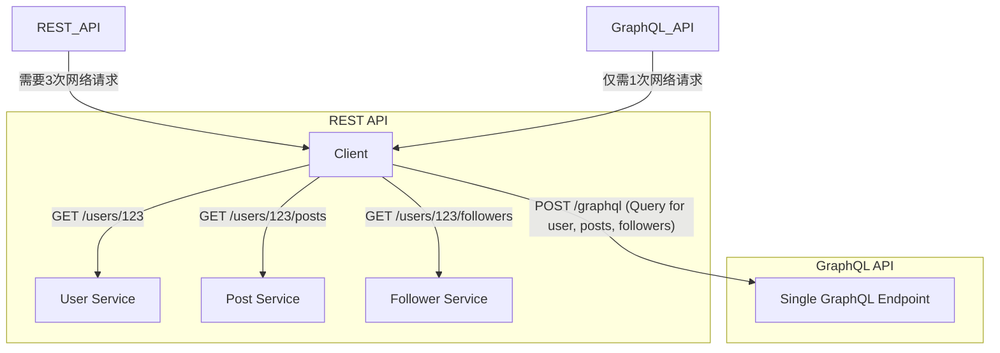
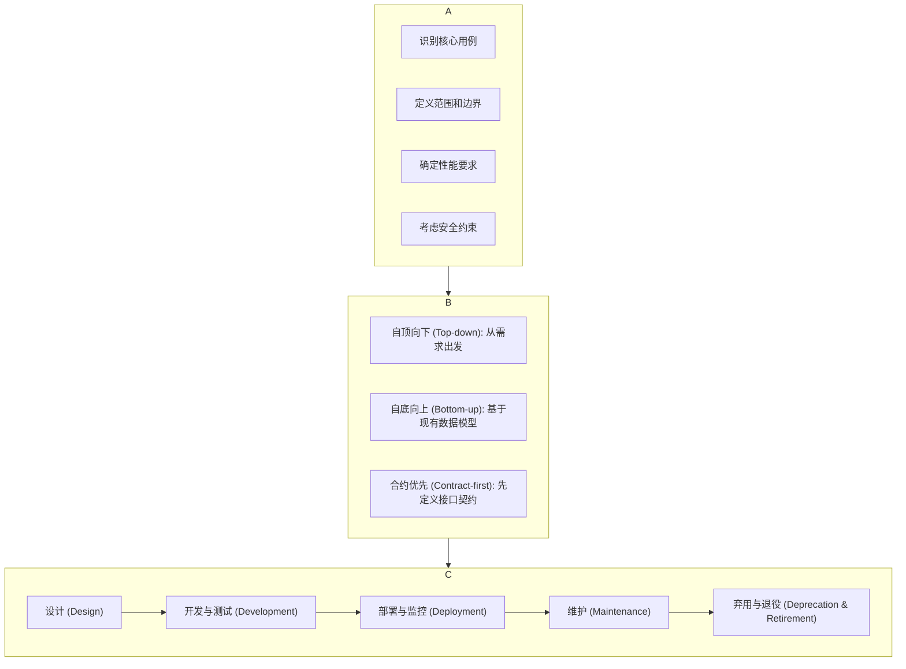
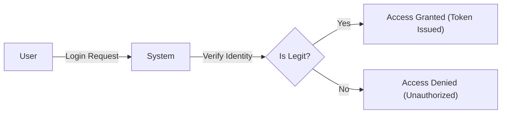

{{从API设计到高级工程思维的跃迁}}

本课程将带你掌握区分初级与高级开发者的关键技能——API 设计。多数开发者仅懂得如何构建基础的 CRUD API，但对 API 的底层工作原理知之甚少，例如：何时选择 REST 而非 GraphQL，何时应采用 HTTP、WebSockets 或消息传递等不同的协议，以及如何落地有效的安全实践。 (见 00:00:22)

这些恰恰是高级工程师在面试中常被问及的核心问题，也是我在真实项目中应用的原则。我们将深入探讨 API 设计原则、网络协议、RESTful 与 GraphQL API 设计、认证、授权及安全实践，涵盖了从基础到高级工程师思维所需的一切知识。如果你正处于初中级开发岗位，渴望获得与高级工程师匹配的薪资，那么这些知识将是你实现目标的关键。

### 📖 1. API 设计基础原则

欢迎来到本节，你将学习 API 设计的基本原则，这些原则将助你创建高效、可扩展且易于维护的软件系统间接口。

本节内容概览：
- **API 的定义**：探讨 API 是什么及其在系统架构中的角色。
- **主流 API 风格**：介绍三种最常用的 API 风格：REST、GraphQL 和 gRPC。
- **卓越 API 的四大设计原则**：讨论构建优秀 API 的核心设计准则。
- **应用协议的影响**：分析应用协议如何影响 API 的设计决策。
- **API 设计全流程**：从设计、开发到部署，了解完整的 API 生命周期。

#### 什么是 API？

API（Application Programming Interface，应用程序编程接口）定义了软件组件之间应如何交互。 (见 00:01:51) 想象一下，一端是用户通过手机或浏览器访问的客户端，另一端是响应请求的服务器。API 在此扮演着一个**合约**的角色，明确了以下条款：
- **可以发出哪些请求**：API 提供了请求的接口，定义了可用的端点（endpoints）、方法（methods）等。
- **可以期待什么响应**：API 规定了针对特定端点，服务器会返回怎样的响应。

API 主要有两个作用：
1.  **抽象机制 (Abstraction Mechanism)**：它向外暴露功能，同时隐藏内部的实现细节。例如，我们可以调用一个 API 来保存用户数据，而完全无需关心服务器内部是如何处理这些逻辑的。我们只与 API 提供的接口交互，通过端点存储用户，对实现细节一无所知。 (见 00:02:47)
2.  **设定服务边界 (Service Boundaries)**：它在不同系统和组件之间定义了清晰的界限。这使得我们可以拥有多个服务器，例如一个负责用户管理，另一个负责帖子管理。这种解耦允许不同系统（如客户端与服务器，或服务器与服务器之间）进行通信，无论其底层实现如何。

[小结] API 是一份定义了交互规则的合约，它通过抽象隐藏了实现复杂性，并通过设定边界实现了系统间的解耦与通信。

#### 主流 API 风格：REST, GraphQL, gRPC 🚀

在设计阶段，你会遇到三种最主要的 API 风格：REST、GraphQL 和 gRPC。

1.  **REST (Representational State Transfer)**
    - **核心思想**：这是一种基于资源（resource-based）的方法，使用 HTTP 协议进行通信。
    - **特点**：REST API 是**无状态的 (stateless)**，意味着每个请求都包含了处理它所需的所有信息，不依赖于之前的任何请求。它使用标准的 HTTP 方法，如 `GET`（获取）、`POST`（创建）、`PUT`/`PATCH`（更新）和 `DELETE`（删除）。 (见 00:04:10)
    - **适用场景**：因其特性，REST 是 Web 和移动应用中最常用的 API 风格。

2.  **GraphQL**
    - **核心思想**：一种为 API 设计的查询语言，允许客户端精确请求其所需的数据。
    - **特点**：通常只有一个端点（endpoint）处理所有操作。客户端通过在请求的载荷（payload）中指定期望的数据结构来决定响应内容。操作类型分为 `query`（查询数据）、`mutation`（修改数据，相当于 REST 中的 POST/PUT/PATCH）和 `subscription`（用于实时通信）。 (见 00:04:55)
    - **优势**：能够最小化网络往返次数。在 REST 中可能需要三次请求才能获取的数据，GraphQL 通过一次请求就能完成，避免了不必要的网络调用。
    - **适用场景**：推荐用于复杂的 UI 界面，尤其是在不同页面需要不同嵌套层级数据的场景下，GraphQL 是比 REST 更好的选择。

3.  **gRPC (Google Remote Procedure Call)**
    - **核心思想**：一个高性能的远程过程调用（RPC）框架，使用 Protocol Buffers 进行通信。
    - **特点**：方法被定义为 RPC 调用，支持流式（streaming）和双向通信。
    - **适用场景**：非常适合微服务架构和内部系统间的通信，因为它在服务器间通信的效率高于 REST 或 GraphQL。 (见 00:06:12)

[小结] REST、GraphQL 和 gRPC 是三种主流的 API 风格，各有其优势和适用场景。REST 适用于标准 Web 应用，GraphQL 擅长处理复杂数据请求，而 gRPC 则在高性能的内部服务通信中表现出色。

#### REST 与 GraphQL 的实战对比

为了更清晰地理解差异，我们通过一个例子来对比 REST 和 GraphQL。



**REST API 的特点：**
- **基于资源的端点**：URL 通常与资源相关，如 `/users`、`/posts`。
- **可能需要多次请求**：获取关联数据（如用户、其帖子和关注者）可能需要发起多个请求。 (见 00:06:59)
- **固定的响应结构**：对于同一个请求，响应的数据结构是固定的。
- **显式版本控制**：通常在 URL 中包含版本号，如 `/v1/users`。
- **HTTP 缓存**：可以利用 HTTP 的缓存机制。

**GraphQL API 的特点：**
- **单一端点**：所有操作通常都指向一个端点，如 `/graphql`。
- **一次请求获取精确数据**：客户端通过查询语言精确定义所需数据，包括嵌套的关联数据，从而避免多次请求。 (见 00:08:30)
- **客户端定义响应结构**：响应的结构由客户端的查询决定。
- **无版本演进**：模式（Schema）的演进通常不需要版本号，但也可以对特定字段进行版本控制（如 `followersV2`）。
- **应用层缓存**：缓存策略在应用层面实现。

#### 卓越 API 的四大设计原则  Pillars of Great API Design

一个好的 API 甚至可以让你在不阅读文档的情况下就能上手使用。 (见 00:09:32) 这需要遵循以下四个核心原则：

1.  **一致性 (Consistency)** 🧩
    - 使用一致的命名、大小写规范和模式。例如，如果在某个端点使用了驼峰命名法（`userDetails`），就不应在另一个端点使用蛇形命名法（`user_details`）。

2.  **简洁性 (Simplicity)** 🍃
    - 专注于核心用例和直观设计。最小化复杂性，让开发者能快速理解和使用。*最好的 API 是开发者无需阅读文档就能使用的 API*。 (见 00:10:47)

3.  **安全性 (Security)** 🛡️
    - 实施必要的认证（Authentication）和授权（Authorization）。
    - 对所有输入进行验证（Input Validation）。
    - 应用速率限制（Rate Limiting）以防止滥用。

4.  **高性能 (Performance)** ⚡
    - 设计时考虑效率，采用适当的缓存策略。
    - 对大量数据使用分页（Pagination）。
    - 最小化响应载荷（Payload）。
    - 在可能的情况下减少网络往返次数。

[小结] 优秀 API 的设计应遵循一致性、简洁性、安全性和高性能这四大原则，旨在提供直观、可靠且高效的开发体验。

#### API 设计全流程

API 的开发远不止编码，它是一个完整的生命周期。



这个过程从理解需求开始，经过设计、开发、部署、维护，最终可能走向弃用。设计阶段的深思熟虑对后续的维护和演进至关重要。 (见 00:16:21)

---

### 🌐 2. 网络协议：API 的基石

选择错误的协议可能导致性能瓶颈和功能限制。理解协议能帮助我们构建满足延迟、吞吐量和交互模式特定需求的 API。

#### 应用层协议 (Application Layer)

应用层协议位于网络协议栈的顶层，构建于 TCP 和 UDP 等传输层协议之上。它们定义了消息格式、请求-响应模式、连接管理和错误处理。

- **HTTP/HTTPS**：Web API 的基石。HTTPS 是增加了 TLS/SSL 加密的安全版 HTTP，是当今的黄金标准。 (见 00:23:02)
- **WebSockets**：适用于实时、双向通信，如聊天应用或实时数据流。它通过一次握手建立持久连接，服务器可以主动向客户端推送数据。
- **AMQP (Advanced Message-Queuing Protocol)**：一种用于异步通信和保证消息传递的企业级消息协议。常用于生产者-消费者模式，通过消息队列解耦系统。 (见 00:25:52)
- **gRPC**：基于 HTTP/2 的高性能 RPC 框架，常用于服务器间的通信。

#### 传输层协议：TCP vs. UDP

1.  **TCP (Transmission Control Protocol)** 🤝
    - **特点**：可靠但稍慢。它像一个带签收和追踪功能的包裹。TCP 通过**三次握手**建立连接，保证数据包按顺序、无丢失地送达。如果数据包丢失，它会重传。
    - **适用场景**：对数据完整性要求极高的场景，如支付、用户认证、银行系统、电子邮件。 (见 00:32:13)

    ```mermaid
    sequenceDiagram
        participant Client
        participant Server
        Client->>Server: SYN (请求建立连接)
        Server->>Client: SYN-ACK (确认并请求建立连接)
        Client->>Server: ACK (确认连接)
        Note right of Server: 连接已建立, 开始数据传输
    ```

2.  **UDP (User Datagram Protocol)** 🚀
    - **特点**：快速但不可靠。它像寄一封平信，不保证送达，也没有顺序保证。由于没有连接建立和数据校验的开销，它的传输速度非常快。
    - **适用场景**：对实时性要求高、能容忍少量数据丢失的场景，如视频通话、在线游戏、直播流。 (见 00:33:19)

[小结] TCP 提供可靠的数据传输，适用于银行、邮件等场景；UDP 提供快速的数据传输，适用于视频、游戏等实时应用。选择哪种协议取决于你对可靠性和速度的权衡。

---

### 🛠️ 3. API 设计实战

#### RESTful API 设计

RESTful API 使用标准的 HTTP 方法与资源进行交互，是构建 API 最常见的方式。

- **资源建模**：使用**名词复数**形式来表示资源集合，如 `/products`、`/orders`。通过 ID 访问单个资源，如 `/products/123`。避免使用动词，如 `GET /getProducts`。 (见 00:37:01)

- **高级功能**：
    - **过滤 (Filtering)**：通过查询参数筛选结果，如 `GET /products?category=electronics&in_stock=true`。
    - **排序 (Sorting)**：通过查询参数对结果进行排序，如 `GET /products?sort=price_asc`。
    - **分页 (Pagination)**：通过 `page` 和 `limit`（或 `offset`）控制返回的数据量，避免一次性加载过多数据，如 `GET /products?page=2&limit=10`。

- **HTTP 方法与 CRUD 操作**：
    - `GET`：读取资源（安全且幂等）。
    - `POST`：创建新资源（非幂等）。
    - `PUT`：完全替换一个资源（幂等）。
    - `PATCH`：部分更新一个资源（非幂等）。
    - `DELETE`：删除一个资源（幂等）。

- **状态码 (Status Codes)**：使用恰当的 HTTP 状态码来传达请求结果。
    - `2xx` (成功): `200 OK`, `201 Created`, `204 No Content`。
    - `3xx` (重定向): `301 Moved Permanently`。
    - `4xx` (客户端错误): `400 Bad Request`, `401 Unauthorized`, `404 Not Found`。
    - `5xx` (服务器错误): `500 Internal Server Error`。

- **版本控制**：在 URL 中包含版本号，如 `/api/v1/products`，以确保 API 的平滑演进，避免破坏性更新影响现有客户端。 (见 00:48:50)

#### GraphQL API 设计

GraphQL 解决了 REST API 中常见的数据过度获取（Over-fetching）和数据不足获取（Under-fetching）的问题。

- **核心概念**：
    - **Schema（模式）**：客户端与服务器之间的契约，定义了数据类型、查询和变更。
    - **Types（类型）**：定义数据的结构，如 `User` 类型包含 `id`, `name`, `posts` 字段。
    - **Queries（查询）**：用于读取数据，类似于 REST 的 `GET`。
    - **Mutations（变更）**：用于创建、更新或删除数据，类似于 REST 的 `POST`/`PUT`/`DELETE`。 (见 00:54:04)

- **错误处理**：GraphQL 即便在发生错误时也通常返回 `200 OK` 状态码。错误信息会包含在响应体的 `errors` 字段中，允许部分数据成功返回。

- **最佳实践**：
    - **保持 Schema 小而模块化**：便于管理和理解。
    - **避免深度嵌套查询**：通过设置查询深度限制来防止滥用。
    - **使用有意义的命名**：让类型和字段的名称直观易懂。
    - **为 Mutations 使用 Input Types**：将创建或更新操作的参数封装在输入类型中，使 API 更清晰。

---

### 🔐 4. API 安全：认证与授权

#### 认证 (Authentication) - "你是谁？"

认证是验证请求者身份的过程，是安全的第一道门。 (见 00:57:36)



- **基本认证 (Basic Auth)**：将 `username:password` 进行 Base64 编码后发送。简单但不安全，除非在 HTTPS 下使用。
- **Bearer Tokens**：客户端在每个请求中携带一个访问令牌（Access Token）。这是目前 API 设计的标准方法，因为它是无状态且易于扩展的。
- **OAuth 2.0 & JWT (JSON Web Tokens)**：OAuth 2.0 是一个授权协议，允许用户通过受信任的第三方（如 Google, GitHub）登录。成功后，第三方会提供一个包含用户信息的 JWT。JWT 是一个签名的 JSON 对象，无状态且安全。 (见 00:59:29)
- **访问/刷新令牌 (Access/Refresh Tokens)**：现代系统使用短生命周期的访问令牌（用于 API 调用）和长生命周期的刷新令牌（用于获取新的访问令牌），在安全性和用户体验之间取得了平衡。
- **单点登录 (SSO - Single Sign-On)**：用户只需登录一次，即可访问多个关联服务。背后通常使用 SAML 或 OpenID Connect (基于 OAuth 2.0) 协议。

#### 授权 (Authorization) - "你能做什么？"

授权发生在认证之后，用于决定已认证用户可以访问哪些资源、执行哪些操作。 (见 01:04:19)

- **基于角色的访问控制 (RBAC - Role-Based Access Control)**：为用户分配角色（如 `admin`, `editor`, `viewer`），每个角色拥有一组预定义的权限。这是最常见和直接的授权模型。
- **基于属性的访问控制 (ABAC - Attribute-Based Access Control)**：基于用户属性（如部门、年龄）、资源属性（如机密等级）和环境条件（如时间、地点）来动态决定访问权限。更灵活但更复杂。 (见 01:08:13)
- **访问控制列表 (ACL - Access Control List)**：为每个资源维护一个权限列表，明确指出哪些用户可以对其执行哪些操作。非常具体，以资源为中心，例如 Google Docs 的分享权限设置。

[小结] 认证确认用户身份，授权定义用户权限。OAuth 2.0 和 JWT 是实现这些机制的现代技术手段，而 RBAC、ABAC 和 ACL 则是常见的授权模型。

#### API 安全加固七大技术

1.  **速率限制 (Rate Limiting)**：控制客户端在单位时间内的请求次数，防止暴力破解和 DoS 攻击。
2.  **CORS (Cross-Origin Resource Sharing)**：控制哪些域名可以通过浏览器调用你的 API，防止恶意网站冒用用户身份发起请求。
3.  **防注入攻击 (Injection Prevention)**：对所有用户输入进行严格验证和清理，使用参数化查询或 ORM 来防止 SQL/NoSQL 注入。
4.  **Web 应用防火墙 (WAF)**：作为 API 的第一道防线，过滤恶意流量，识别并阻止已知的攻击模式。
5.  **VPN (Virtual Private Network)**：将内部 API 置于 VPN 网络内，只允许连接到公司网络的员工访问，保护内部工具和敏感数据。
6.  **CSRF (Cross-Site Request Forgery) 防护**：使用 CSRF 令牌，确保请求是由你的应用前端合法发起的，而不是由恶意网站伪造的。 (见 01:20:30)
7.  **XSS (Cross-Site Scripting) 防护**：对所有用户生成的内容进行输出编码或清理，防止攻击者在页面中注入恶意脚本。

### 结语：从理论到实践

仅仅了解这些理论概念是不足以成为一名高级工程师的。真正的成长来自于在真实项目中亲手实践这些原则，权衡各种方案的利弊，并构建出安全、可扩展的系统。理论知识为你指明方向，但只有通过实践，才能将这些知识内化为自己的核心竞争力。 (见 01:03:04)