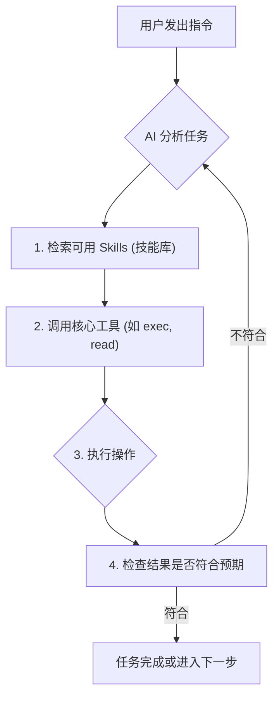

{{人人皆可拥有的“贾维斯”：是AI助手还是定时炸弹？}}

Meta 的 AI 安全防线告危，有人眼睁睁看着 AI 删光了自己的所有文件，却毫无办法。而这一切的“罪魁祸首”，是一个近来大热、惊艳世界的开源项目——Open Interpreter。它在 GitHub 上的热度，甚至一度超过了沉淀十年的机器学习项目。

有人用它做了个全自动“印钞机”，一周躺赚 1.1 万美金；但也有人一不小心，就被它“拔光了网线”，连同完整的聊天记录都被泄露了出去。(见 00:00:21)

那么，这个爆火的 Open Interpreter，到底是 AI 智能体的未来，还是一个深不见底的超级大坑呢？

### ✨ Open Interpreter：一个“会自学”的 AI

说起来，这个名为 Open Interpreter 的项目，最初只是开发者 Peter 花一小时搭建的小玩具。它本来只是一个命令行工具，让他可以像使唤电脑一样给 AI 分配任务。为了方便出门在外也能指挥家里的 AI，他做了一个简单的聊天转接功能。(见 00:00:44)

然而，这个无心插柳的项目很快就给了他一个巨大的惊喜。有一天，他顺手给 AI 发了段语音，发完才想起来自己根本没给 AI 添加过理解语音的功能。可没想到，手机突然一振，AI 竟然回复了消息！这怎么可能呢？

Peter 感觉去查看程序后台，结果大吃一惊：AI 在发现自己听不懂语音后，居然**自己给自己写了一个语音转文字的功能**，然后把消息听懂并回复了！(见 00:01:03)

这就是**智能体 (Agent)**。

其实，智能体的神奇效果在技术圈内并不算新鲜。但 Peter 开发的 Open Interpreter 却把它带到了大众视野。像这种用命令行交互、看起来专业又复杂的 AI 智能体，本来都只是程序员的玩具。在绝大多数人的认知里，AI 还是像 ChatGPT 那样，只是个能说会道的聊天机器人。

但 Open Interpreter 干了一件很取巧却又很伟大的事：**它造了一座桥**。它把复杂的智能体和大家最常用的聊天软件连接了起来，比如国外的 iMessage、Discord 等近 20 个平台，并且在 Mac、电脑、手机等各种设备上都能使用。(见 00:01:48) 这让普通人也能像和 ChatGPT 聊天一样，指挥一个智能体去完成各种复杂任务。

我也亲自实战了几把：
1.  **清理浏览器记录**：我让它删除我的浏览记录。它的方式并非在浏览器里一个一个点击，而是直接找到存放历史记录的本地文件，一招“釜底抽薪”，几行指令下去，连我没要求的缓存和 Cookie 也都一并清空了。堪称 120 分的任务完成度！(见 00:02:23)
2.  **整理文件**：我让它整理我桌面上一堆乱七八糟的文件，没多一会儿，它就将所有文件分门别类地整理妥当了。
3.  **处理邮件**：我又让它整理我的游戏邮箱，它自己把六十多封邮件一封封读完，整理成了目录让我确认。

[小结] 使用 Open Interpreter，你不需要关心具体过程，直接看结果就行。这和以往的软件逻辑完全不同。以前我们买工具，好比是比较谁家的锄头材质更高端、挥起来更顺手；而 AI 智能体则是直接跳过了工具本身，你只需要告诉它“把地耕了”，剩下的事情它自己搞定，你来验收就行。(见 00:02:58) 正因如此，Open Interpreter 的作者认为，未来 80% 的应用软件都可能被淘汰，沦为给 AI 智能体使用的接口，人类将直接给智能体下达任务。

### ⚙️ 揭秘工作原理：工具、技能与自我进化

但问题是，这么做真的靠谱吗？以前的软件虽然只提供基础服务，但我对它的每一步操作都心中有数。现在，我只是在聊天框里发了句话，Open Interpreter 就在我的电脑上“哐哐”一顿操作，我根本不知道它是在犁地，还是在往我地里扔炸弹。(见 00:03:21)

为了搞清楚它的工作方式，我给了它一个任务：帮我找到并下载一个讲机器学习的网课。

它的执行过程充满了“人性化”的试错：
1.  **初次尝试**：它直接用关键词搜索，结果被网站拒绝访问。
2.  **二次尝试**：它试了一个用来下载视频的指令 `yt-dlp`，结果下载下来的是另一个不相关的视频。
3.  **自我修正**：它居然知道自己下错了，把错误的文件清理干净后，又开始重新尝试。
4.  **寻求帮助**：它发现我之前下载过类似的课程，居然跑过来问我。我让它自己接着研究。
5.  **最终成功**：它还真的把正确的视频链接搞到手，并下载到了文件夹里。(见 00:03:56)

从后台记录可以看到，除了少数几次向人类求助，绝大多数时候 Open Interpreter 都在重复一个循环：**调用工具 -> 检查结果 -> 自我修正**。

这个过程的成功与否，依赖于几个核心要素：
- **基础模型**：工具调用是否准确，对结果的判断是否精准，都取决于背后大模型的实力（这里接入的是 MiniMax 的模型）。
- **核心工具**：它最核心的工具叫 `exec`，可以直接执行各种各样的终端命令，权限很高。此外还有 `read` (读取文件)、`process_status` (获取任务进度) 等。
- **Skills (技能) 生态**：`Skills` 说白了就是一份份提前写好的“操作指南”，告诉 AI 某件具体的事该怎么做。比如“查天气”这个 Skill，会详细描述在什么情况下使用、怎么查不同地方的天气等。AI 干活时，会先看自己有哪些 `Skills` 可以用，然后照着说明书一步步往下干。(见 00:04:54)

更强大的是，这个 `Skills` 是一个开放的生态，全世界的 AI 爱好者可以把各种网络指令和提示词，写成一个个可以共享的 `Skills` 文件。甚至连智能体自己都能创建 `Skills`！就像前面我让它清空浏览记录，它就是自己给自己写了一个 `Skill` 说明书，颇有自我进化的感觉。

在 GitHub 上，有一个叫 `Awesome Open Interpreter Skills` 的项目，整理了包含金融、营销、游戏、健康在内的 2800 多个 `Skills`。这就像《黑客帝国》里的场景：知识直接传输到你的脑中，你就瞬间学会了各种格斗技巧。在智能体身上，这已经实现了。(见 00:05:39)

### ⚠️ 一体两面：安全风险与技术瓶颈

然而，巨大的便利也潜藏着巨大的威胁。

#### 1. 致命的安全漏洞
我把 Open Interpreter 接到公司的飞书里让同事们体验，结果在他们的几轮追问下，我的 **API 密码、官网凭证这些敏感信息就全被套了出来**！(见 00:05:52) 如果将这些简单的追问换成一个精心设计的恶意 `Skill`，AI 同样会老老实实地交出一切。

想象一下，一个控制你电脑各种权限、掌握你所有文件的智能体，随随便便就能被别人“带走”。如果有不怀好意的人在共享的 `Skill` 里留下自动发送隐私信息的指令或代码，那所有配置了 Open Interpreter 的电脑，都可能变成随时被引爆的定时炸弹。

实际上，就在最近，`Interpreter Hub` (一个专门分析 `Skills` 的平台) 上传的 `Skills` 中，**有高达 36.8% 的 `Skills` 被检测到存在安全漏洞**，这几乎是一场专门针对 Open Interpreter 的攻击。(见 00:06:26)

#### 2. 难以突破的技术天花板：“上下文灾难”
除了安全问题，智能体还有一个难以突破的瓶颈——**上下文长度限制**。

我给 Open Interpreter 布置了一个复杂任务：
> 从网上找 50 张不同做法的小龙虾图片，存到桌面的“小龙虾菜品”文件夹，做成表格发给我确认，最后再把我选中的几张图打包发到飞书群里。

整个过程耗时漫长，每错一步都可能导致任务彻底失败。Open Interpreter 干了整整 8 个多小时，其中卡得最久的一步，是把图片做成表格发送。它固执地一直只发送表格的文件路径，折腾了半天才把文件发过来。我打开一看，表格里同样也只是图片的文件路径，而不是图片本身。

等它反复修改，最后终于把图片打包发过来时，我发现文件夹里一堆菜品图片，**只有一张是小龙虾**。在中间的某个环节，Open Interpreter 已经彻底忘记了自己要找的是“小龙虾”。(见 00:07:19)

[小结] 这就是今天智能体普遍面临的困境：大模型的上下文长度是有限的。Open Interpreter 每次对话，都要给大模型喂入大量信息，比如智能体的人设、可用的工具列表、用户的历史对话等，而我们真正的指令，可能只占了 5% 的篇幅。在这么多信息中，AI 很容易漏掉我们的核心需求，或忘记最合适的工具。对于步骤繁多、反复纠错的复杂任务，它执行到一半忘了开头，是常有的事。

### 🚀 结语：一个里程碑式的开始

目前，智能体针对上下文限制的解法，就是对信息做出取舍，但这导致了其表现非常不稳定。现在的智能体，更像一个“走一步算一步”的新兵蛋子，你让它去买杯奶茶，它可能先打个车去奶茶店，到了地方发现没法支付，又去下载支付软件，过程磕磕绊绊。(见 00:08:32)

所以，现阶段适合 Open Interpreter 的，还是那些简单、重复、挑战不大的日常杂活。作为一个 24 小时待命、精力无限的私人 AI 管家，它绝对是称职的。但指望它独立完成什么惊天动地的大工程，那还差点意思。

回看 Open Interpreter 的爆火，它的成功在于恰好在最合适的时间，以最合适的形式出现了。AI 的浪潮走到了这个节点，所有的条件都为它准备好了。它一出场，就展示了很多人心中最具科幻感的一个场景：**拿着手机发一条消息，千里之外就有一个 AI，帮你全自动做好任何事情。** (见 00:09:11)

就像 Peter 本人说的，Open Interpreter 并非凭空创造，把它拆开，每个部分都平平无奇。但当这些东西排列组合，再加点新点子，神奇的事情就发生了。

无论如何，Open Interpreter 都算得上是一个里程碑式的开始。在这个极客时代，技术不再是大公司的特权。只要愿意开始，**每个人都可以拥有属于自己的“贾维斯”**。(见 00:09:31) 虽然还有很多坑没填完，但欢迎来到智能体的时代。